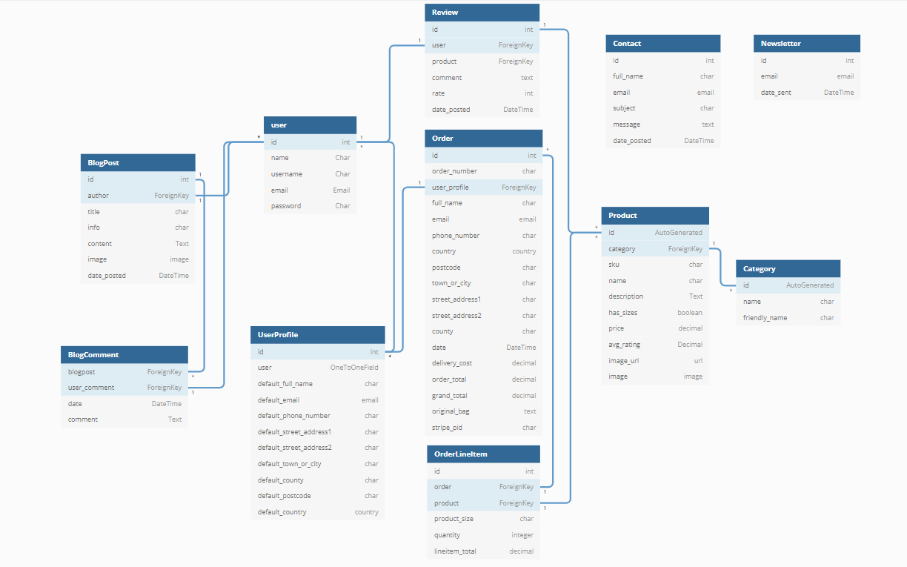
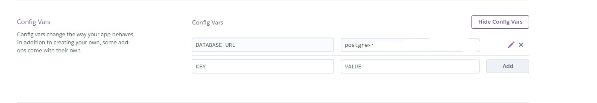

## Milestone 4 Unique Wings - by Eva Kukla


- [Overview](#overview)

- [User stories](#user-stories)

- [UX](#ux)

  - [Strategy](#strategy)

  - [Scope](#scope)

  - [Structure](#structure)

    - [Database Schema](#database-schema)

  - [Skeleton](#skeleton) 
    - [Wireframes mockups](#wireframes-mockups)
  
  - [Surface](#surface) 


- [Features](#features)

- [Technologies used](#technologies-used)

- [Resources](#resources)

- [Testing](#testing)

- [Code validity](#code-validity)

- [Version Control](#version-control)

- [Deployment](#deployment)

  - [AWS S3 Bucket](#AWS-S3-Bucket)

  - [Deployment Platform](#deployment-platform)

- [Credits](#credits)

- [Acknowledgments](#acknowledgments)


## Demo

---


- A live demo can be found [here](https://eva-kuk.github.io/unique-wings/)

- A github repository can be found [here]()


## Overview
This is my fourth of Milestone Project 4 which is part of the Code Institute's FullStack Software Development Diploma Course and the main requirements is to build a full-stack website based around busines logic used to control a centrally-owned dataset which contain set up an authentication access mechanism and provide paid access to the site's data and purchase of the product.

This project demonstrates the skills and knowledge of using the HTML5, CSS3, JavaScript, Python, Django, AWS, Relational database Postgres and Stripe payments in Back-End development which I have learned recently on the course.


The idea to create this website came from the inspiration of my best friend, who is a devoted fashion follower and passionate about unique creations, beautiful shoes and handbags, which she might show a quite few in her beautifull collection. 
The aim of this project is to create an e-commerce web application name **Unique Wings** for women but not only, for everyone for whom fashion plays a big role, who love and looking for unique, unusual and extraordinary shoes and bags, which accent their style. The users will find on the website products designed with bird and butterfly motif. 

The brand name of the website "Unique Wings" was inspired not only by the beautiful and colorful parrots, peacocks and butterflies, which are the main theme of the collection offered in the store but is worth mentioning that the wings from Greek and Roman mythology were once an attribute of the gods. Nowadays they are a symbol of lightness, uniqueness and freedom, just like the shoes offer in the store which are not only unique and beautiful but also light and comfortable to wear. For many people, wings can also mean making their innermost dreams come true and believing that the impossible may become possible. I hope users can find on this page a collection of shoes and handbags which are not belonging to the cheapest but certainly belonging to the original and unique models which every women will be delighted to have in her wordrobe.

Users can search for and purchase unique shoes and bags via text search, designers or categories.

Users can create an account to save delivery information for future use, review their orders and logged in users are also able to leave rating on products and write a comment under the blog posts.

The owner/administrator of the shop  (with the appropriate access) can add, edit and delete products, and create news posts about new delivery, promotions, fashion and designers.

The project is for educational purposes only.
---

## User stories

---
**Viewing and navigation**

| User Story ID | AS a/an                     | I want to be able to ...                                   | So that I can ...                                            |
| ------------- | --------------------------- | ---------------------------------------------------------- | ------------------------------------------------------------ |
| 1.            | new user                    | recognise the purpose of the site immediately              | identify whether I am interested in the content and wish to use the site |
| 2.            | new user                    | easily navigate the site                                   | find what I need effectively                                 |
| 3.            | new user                    | to access the website on a desktop and also mobile devices | use it on a desktop or on the go                             |
| 4.            | general visitor             | to contact the website owner                               | make about the product, purchase, return policy              |
| 5.            | general user                | to read some information about shoe designers              | get to know their brand better                               |
| 6.            | general user                | view blogs                                                 | get new information's about the shop, designers              |
| 7.            | new user and future shopper | view a list of shoes                                       | find which shoes I'd like to purchase                        |
| 8.            | new user and future shopper | view individual shoe details                               | identify the price, description, shoes rating,  image and available sizes before deciding to purchase. |
| 9.            | new user and future shopper | quickly identify sales, pomotions and special offers       | take advantage of special savings on products I'd like to purchase |
| 10.           | new user and future shopper | easily view the total of my purchases at any time          | avoid spending too much                                      |


**Registration and User Accounts**       

| **User Story ID** | **AS a/an**                 | **I want to be able to ...**                    | **So that I can ...**                                        |
| ----------------- | --------------------------- | ----------------------------------------------- | ------------------------------------------------------------ |
| 11.               | new user and future shopper | easily register for an account                  | have a personal account and be able to view my profile       |
| 12.               | registered user             | easily login/out                                | access my personal account information                       |
| 13.               | registered user             | easily reset my password in case I forget it    | recover  access to my account if I have forgotten my password |
| 14                | registered user             | receive an email confirmation after registering | verify that my account registration was succesful            |
| 15                | registered user             | have a customized dashboard                     | view my personal order history and order confirmation, and save my payment information |

**Sorting and searching**      

| **User Story ID** | **AS a/an** | **I want to be able to ...**                                | **So that I can ...**                                        |
| ----------------- | ----------- | ----------------------------------------------------------- | ------------------------------------------------------------ |
| 16.               | Shopper     | sort the list of available shoes                            | easily identify the best rated, best priced and categorically sorted products |
| 17.               | Shopper     | sort a specific category of shoes depending on the designer | find the best-priced or best-rated shoes in a specific designer category, or sort the shoes in that category |
| 18.               | Shopper     | sort multiple categories of shoes simultaneously            | find the best-priced or best-rated product across broad categories, such as "high hills" , "flats", "boots" |
| 19.               | Shopper     | search for a product by name or description                 | Find a specific product I'd like to purchase                 |
| 20.               | Shopper     | Easily see what I've searched for and the number of results | Quickly decide whether the product I want is available       |


**Purchasing the checkout**

| **User Story ID** | **AS a/an** | **I want to be able to ...**                                 | **So that I can ...**                                        |
| ----------------- | ----------- | ------------------------------------------------------------ | ------------------------------------------------------------ |
| 21.               | shopper     | easily select the size and quantity of a product when purchasing it | Ensure I don't accidentally select the wrong product, quantity or size |
| 22.               | shopper     | view details about the items in my shopping bag              | decide if I want to purchase an item or edit it              |
| 23.               | shopper     | easily add, edit & delete items in my shopping bag           | adjust my total to fit into my budget                        |
| 24.               | shopper     | revisit my shopping cart after logging in and logging out    | complete my purchase without re-adding every single item     |
| 25.               | shopper     | checkout using credit/debit card                             | purchase chosen products                                     |
| 26.               | shopper     | receive my digital order via email                           | access the item I just purchased                             |

**Navigation**  

| **User Story ID** | **AS a/an** | **I want to be able to ...**                         | **So that I can ...**              |
| ----------------- | ----------- | ---------------------------------------------------- | ---------------------------------- |
| 27.               | site owner  | access product management from the homepage          | access my account                  |
| 28.               | site owner  | access my dashboard from the homepage                | return to my dashboard at any time |
| 29.               | site owner  | receive a notification when there is a pending order | know when I am making money        |

**Product management**

| **User Story ID** | **AS a/an** | **I want to be able to ...**                                | **So that I can ...**                                        |
| ----------------- | ----------- | ----------------------------------------------------------- | ------------------------------------------------------------ |
| 30.               | site owner  | add new products                                            | add new items to my online store                             |
| 31.               | site owner  | edit/update products                                        | update products prices, descriptions, images and other product criteria |
| 32.               | site owner  | delete products                                             | remove erroneous products or products that are no longer available |
| 33.               | site owner  | preview & verify new products before submitting to the shop | check for correct description, grammatical errors and mistakes |
| 35.               | site owner  | add, edit, delete blog post                                 | add new posts to their blog                                  |
| 36.               | site owner  | Edit/Update a blog post                                     | change post name, content, and image                         |
| 37.               | site owner  | Delete a blog post                                          | remove a blog post                                           |
| 38.               | site owner  | make a draft blog post                                      | work on a blog post before letting it be viewable to the website visitors |


 **Authentication & account**    

 | **User Story ID** | **AS a/an** | **I want to be able to ...**           | **So that I can ...**                      |
| ----------------- | ----------- | -------------------------------------- | ------------------------------------------ |
| 39.               | site owner  | verify my email address                | set up my account securely                 |
| 40.               | site owner  | update my account information          | maintain access to my account              |
| 41.               | site owner  | logout when I am finished with my work | logoutof my account                        |
| 42.               | site owner  | reset my password                      | recover my account or upgrade its security |


## UX 
(5 planes)

---
1. ## Strategy

The target audience for the proposed website are women but not only, for everyone who are a fashion enthusiasts, who are looking for unique and unusual shoes and bags. Users will be able to get more information about the shoes designers, follow the news from fashion and new shoe models posted on the blog on an ongoing basis. They will be able to register and login into their account, keep the order history in one place, shere their thoughts and add comments on the blogpost, rate shoes and bags at store.

The main goal of this project was to create an e-commerce web application where users can find unusual shoes where the main motif are birds and butterflies. There also will be able to match bags with their shoes or choose just a bag. The users can secure purchase all products through secure process.     

It is intended to be used as an full-stack application with clean and user - friendly site design.

**Project purpose:**
- To create an easy-to-use online e-commerce web application, providing a user-friendly interface with full functionality.
- Create an online shop where users can buy unusual shoes and bags.
- An incentive to buy shoes and handbags presented in the store.

**Site owner goals:**
- Build a store with two different collections shoes ang bags wher users can search for, secure purchase
- To create, update and delete unnesesary products.
- To provide the blog with the latest collections, fashion news which encourage users to return to the site

**Customer Goals:**
- Easy to register and log in into the account.
- Easy to search for shoes ang bags by categories, rating, price, and find  the information about them
- Easy and secure checkout process.
- Easy to find links to social media accounts to follow the news about the website.
- Easy to find contact form for possible enquiries about profile or recipes.
- Easy to find and enjoy reading latest posts collections, news on the blog.

2. ## Scope

**Functional Requirements**

- Mobile-first website that is responsive on all devices.
- Informative Landing Page
- The navbar has been fixed, and is accessed by clicking on the 'hamburger' icon in the top left hand corner of the screen on small and medium devices. When the 'hamburger' icon is clicked, the 'All Products', 'Shoes', 'Bags', 'Special Offers',  'Blog' and 'Contact links are displayed, as well as a 'home' link.
- The Search box has been replaced by an icon on small devices, which displays a search box when clicked.
- Search by a keyword function that users can search for product by keyword

3. ## Structure
The frontend is integrated into the backend using Python and Django with a PostgreSQL Database.
The site has a simple layout, heavily influenced by the Bootstrap framework.
The navbar always sits at the top of each page, taking the user to all the site sections they can access. Only the pages relevant to the user are displayed e.g. a logged-in user will not see a link to the 'login' page as they are logged in. Equally, a logged out user will not see a link to the 'logout' page as they are already logged out.  If a user tries to manually enter an invalid page URL, they will be redirected automatically to the homepage. There is also a search bar on the navbar, prompting a user to search for a 'mountain' or resort.

An unauthenticated user cannot access certain parts of the website such as the 'bag' and 'checkout' pages as only an authenticated user can make purchases.  
If a user tries to access a 'forbidden' page, they will be either automatically redirected with an error message toast appearing or asked to log in/register as required.

## Database Schema

### **DATA MODELS RELATIONS**

**Database Structure**



**Relational Database tables schema**

### "UserProfile" model used to store user information. The "UserProfile" is linked to the "User" and "Order" model.

| *Field*                 | *Field type*  | *Attributes*                                 |
| ----------------------- | ------------- | -------------------------------------------- |
| user                    | OneToOneField | User, on_delete=models.CASCADE               |
| default_full_name       | CharField     | max_length=50, null=True, blank=True         |
| default_email           | EmailField    | max_length=254, null=True, blank=True        |
| default_phone_number    | CharField     | max_length=20, null=True, blank=True         |
| default_country         | CountryField  | blank_label='Country', null=True, blank=True |
| default_postcode        | CharField     | max_length=20, null=True, blank=True         |
| default_town_or_city    | CharField     | max_length=40, null=True, blank=True         |
| default_street_address1 | CharField     | max_length=80, null=True, blank=True         |
| default_street_address2 | CharField     | max_length=80, null=True, blank=True         |
| default_county          | CharField     | max_length=80, null=True, blank=True         |

### "User" Model is created by django All Auth on registration, it stores the name, email and password of a user.

| *Field*  | *Field type* | *Attributes* |
| -------- | ------------ | ------------ |
| name     | Charfield    |              |
| username | Charfield    |              |
| email    | EmailField   |              |
| password | Charfield    |              |


### Checkout - "Order" model is connected to the user profile, feeding in the shipping and contact information. It creates an instance of an order on the data base with billing information, date and time of placement and by whom. The order model is linked to the"OrderLineItem" model which holds the product information for the order placed.

| *Field*         | *Field type*  | *Attributes*                                                 |
| --------------- | ------------- | ------------------------------------------------------------ |
| order_number    | CharField     | max_length=32, null=False, editable=False                    |
| user_profile    | ForeignKey    | UserProfile, on_delete=models.SET_NULL, null=True, blank=True, related_name='orders' |
| full_name       | CharField     | max_length=50, null=False, blank=False                       |
| email           | EmailField    | max_length=254, null=False, blank=False                      |
| phone_number    | CharField     | max_length=20, null=False, blank=False                       |
| country         | CountryField  | blank_label='Country *', null=False, blank=False             |
| postcode        | CharField     | max_length=20, null=True, blank=True                         |
| town_or_city    | CharField     | max_length=40, null=False, blank=False                       |
| street_address1 | CharField     | max_length=80, null=False, blank=False                       |
| street_address2 | CharField     | max_length=80, null=True, blank=True                         |
| county          | CharField     | max_length=80, null=True, blank=True                         |
| date            | DateTimeField | auto_now_add=True                                            |
| delivery_cost   | DecimalField  | max_digits=6, decimal_places=2, null=False, default=0        |
| discount        | DecimalField  | max_digits=6, decimal_places=2, null=False, default=0        |
| order_total     | DecimalField  | max_digits=10, decimal_places=2, null=False, default=0       |
| grand_total     | DecimalField  | max_digits=10, decimal_places=2, null=False, default=0       |
| original_bag    | TextField     | null=False, blank=False, default=''                          |
| stripe_pid      | CharField     | max_length=254, null=False, blank=False, default=''          |


### Checkout - "OrderLineItem" model used to store and add items to order model. The Order Line Item model is linked to products.

| *Field*        | *Field type* | *Attributes*                                                 |
| -------------- | ------------ | ------------------------------------------------------------ |
| order          | ForeignKey   | Order, null=False, blank=False, on_delete=models.CASCADE, related_name='lineitems' |
| product        | ForeignKey   | Product, null=False, blank=False, on_delete=models.CASCADE   |
| product_size   | CharField    | max_length=2, null=True, blank=True                          |
| quantity       | IntegerField | null=False, blank=False, default=0                           |
| lineitem_total | DecimalField | max_digits=6, decimal_places=2, null=False, blank=False, editable=False |


### "Product" model creates objects containing individual product information, such as name, description, price, image and sku. - The unique ID is auto generated. The product model is linked to the categories model which divides the products into subsections. The product objects will be used for the order model and favourites model.

| *Field*     | *Field type* | *Attributes*                                                 |
| ----------- | ------------ | ------------------------------------------------------------ |
| category    | ForeignKey   | 'Category', null=True, blank=True, on_delete=models.SET_NULL |
| sku         | CharField    | max_length=254, null=True, blank=True                        |
| name        | CharField    | max_length=254                                               |
| description | TextField    | ()                                                           |
| has_sizes   | BooleanField | default=False, null=True, blank=True                         |
| price       | DecimalField | max_digits=6, decimal_places=2                               |
| rating      | DecimalField | max_digits=6, decimal_places=2, null=True, blank=True        |
| image_url   | URLField     | max_length=1024, null=True, blank=True                       |
| image       | ImageField   | null=True, blank=True                                        |


### Category Model

| *Field*       | *Field type* | *Attributes*                          |
| ------------- | ------------ | ------------------------------------- |
| name          | Charfield    | max_length=254                        |
| friendly_name | CharField    | max_length=254, null=True, blank=True |


### "BlogPost" Model used to add and store articles. This model is linked to the "BlogComment" Model and stores Blogpost content, image and posted date.

| *Field*     | *Field type*          | *Attributes*                          |
| ----------- | --------------------- | ------------------------------------- |
| image       | ImageField            | null=True, blank=True                 |
| title       | "TextField"/CharField | max_length=254, null=True, blank=True |
| content     | TextField             | max_length=1000                       |
| date_posted | DateTimeField         | auto_now_add=True                     |


### "BlogComment" Model  is linked to the "BlockPost" and "User" models and it's used to store users comments about the Blogpost

| *Field*      | *Field type*  | *Attributes*                                                |
| ------------ | ------------- | ----------------------------------------------------------- |
| blogpost     | ForeignKey    | BlogPost, on_delete=models.CASCADE, related_name='comments' |
| user_comment | ForeignKey    | user, on_delete=models.CASCADE                              |
| date         | DateTimeField | auto_now_add=True                                           |
| comment      | TextField     | max_length=1024, null=False, blank=False                    |


### "Contact" Model stores users queries in the backend for the admin user to view.

| *Field*     | *Field type*  | *Attributes*                                                 |
| ----------- | ------------- | ------------------------------------------------------------ |
| full_name   | Charfield     | max_length=50, null=False, blank=False                       |
| email       | EmailField    | max_length=254, null=False, blank=False                      |
| subject     | CharField     | (max_length=50, choices=SUBJECT_MENU, default='general_query', null=False, blank=False) |
| message     | TextField     | max_length=1000, blank=False, null=True                                      |
| date_posted | DateTimeField | auto_now_add=True                                            |

### "NewsletterUserSubscription" model is used to store users emails for newsletter subscription.
| *Field*     | *Field type* | *Attributes*                      |
| ----------- | ------------ | --------------------------------- |
| email  | EmailField   | max_length=254, null=False, blank=False |
| date_sent | DateTimeField  | auto_now_add=True |


### "Review" model is used to store users comments for each product. "Review" model is linked to the "Product" and ""User" Model.

| *Field*     | *Field type* | *Attributes*                      |
| ----------- | ------------ | --------------------------------- |
| product     | ForeignKey   | Product, on_delete=models.CASCADE |
| user        | ForeignKey   | UserProfile, on_delete=models.CASCADE|
| comment     | TextField    | max_length=500                    |
| rate        | IntegerField | choices=RATE                      |
| date_posted | DateTime     | auto_now_add=True                 |


4. ## Skeleton

## Wireframes mockups

Below are the wireframes created in advance of starting the project. I used the wireframing software [Balsamiq](https://balsamiq.com/) for this project.

**HOME PAGE**


**PRODUCTS PAGE**


**EXAMPLE PRODUCT PAGE**


**MY SHOPPING BAG PAGE**


**ORDER CONFIRMATION PAGE**


**PROFILE PAGE**


**LOGIN PAGE**


**REGISTER PAGE**


**CONTACT PAGE**


**ADMIN/PRODUCT MANAGEMENT PAGE**


**BLOG PAGE**


**SINGLE BLOGPST PAGE**


**500 INTERNAL SERVER ERROR PAGE**


**404 NOT FOUND ERROR PAGE**


5. ## Surface

**Colors**

For this project I have decied to use the simple color pallete as the website will contain many collorfull images with shoes and bags.
- For navigation bar, footer and buttons, I have chosen a shade of teal:  **Blue Munsel (#288FA4)** which is one of the colors of shoes displaying on the home page.Reffering to the website 
[color-meanings](https://www.color-meanings.com/teal-color-meaning-the-color-teal/)
teal color, comprised of blue shades and green tones it has unique values and symbolizes individuality, renewal. It is also very welcoming color.
- For the background color and some text  I have chosen white off-which **Cultured(#F5F9F9)** which will create harmony with images, text, buttons, and icons. Reffering to the website: 
[inspiration-feed](https://inspirationfeed.com/how-a-white-background-can-improve-your-website/) - 6 Tips on Using White Background in Modern Website Design. 
White is associated with cleanliness, perfection, newness, honesty, and new beginnings. It can help to create a focus on certain design elements and make text and headlines readable.A white background is one of the simplest ways to focus visitors’ eyes on something important.
- As a text color, discount information I have chosen a **Ritch Black (#14161F)**
- For the warning signs, delete buttons I have chosen the **Violet Red (#F05193)** which also is one of the shoes colors.

 

 **Typography**
- For creating logo "Butterfly" and main headings I have chosen font [Princess Sofia](https://fonts.google.com/specimen/Princess+Sofia?preview.text=All%20products%20Shoes%20&preview.text_type=custom&query=prince#standard-styles) that resembles a butterfly and also because of its originality, which aims to make the brand unique.

- For the navigation bar headings I have selected font [Lato](https://fonts.google.com/specimen/Lato?preview.text=All%20products%20Shoes%20&preview.text_type=custom&query=lato#standard-styles) with the group of fall-back font of **sans-serif**. 

- For the content, I have chosen font [Roboto](https://fonts.google.com/specimen/Roboto?preview.text=All%20products%20Shoes%20&preview.text_type=custom&query=roboto) with a fallback of **sans-serif**, which according to "Google font" website not only is a matching a font for Princess Sophia and Lato fonts which won't make it too crowdy using three different fonts but also is considered a reader-friendly, elegant which has been designed to be easy on the eye. 
Both the 'Lato' and 'Roboto' are the recommended fonts used on e-commerce sites by article from[rocketium](https://rocketium.com/academy/20-best-fonts-for-ecommerce-businesses/) about 20 best fonts for e-commerce

 **Images**

As the idea behind the e-commerce site is the collection and sale of unusual shoes and handbags, mainly designed by two designers, on the main page I have created a hero image on which I placed shoes belonging to the collection of both designers. For the store I have chosen pictures of beautifull, unique and unusual shoes and bags with motifs of butterflies and birds. 
 Pictures are downloaded from the [Kat Maconie](https://katmaconie.com/) and [Sophia Webster](https://www.sophiawebster.com/). This project is for educational purposes only so the accociated credit has been included in the credits section. 

The default image if image of the product is not available 

## Features
**Existing Features**


**Features Left to Implement when skills develop**
mozliwos kilku zdjec dla jednego produktu
mozliwosc logowania przez gmail, facebook
mozliwosc wysylania automatycznie maila welcome mail gdy user subscribe


---


## Technologies Used

**1. Languages**

-   – [HTML5](https://developer.mozilla.org/en-US/docs/Web/HTML)

-  - [CSS3](https://developer.mozilla.org/en-US/docs/Web/CSS)

-   - [Python](https://www.python.org/)

-   – [JavaScript](https://developer.mozilla.org/en-US/docs/Web/JavaScript)


**2. Integrations**

-   - [django](https://www.djangoproject.com/)  website creating framework software.

-   [stripe]( https://balsamiq.com/) - a secure processing payment platform.


-   – [bootstrap](https://getbootstrap.com/)  CSS framework directed at responsive, mobile-first front-end web development

-   - [Font Awesome](https://fontawesome.com/) is the source of all icons.

-   - [Google Fonts](https://fonts.google.com/) used on the website courtesy of Google Fonts

-   - [jQuery](https://jquery.com/) The project uses JQuery to simplify DOM manipulation.

**3.Version Control, database and hosting**

-   - [Gitpod](https://www.gitpod.io/) Main workspace IDE (Integrated Development Environment)

-   – [Git](https://git-scm.com/book/en/v2/Getting-Started-About-Version-Control ) Distributed Version Control tool to store versions of files and track changes.

-   - [GitHub](https://wikipedia.org/wiki/GitHub) Used to store the project repository and deploy the site via github pages.

-  - [Heroku](https://www.heroku.com/what) was used in order to deploy the website

-  - [Amazon Web Services](https://en.wikipedia.org/wiki/Amazon_Web_Services) a cloud platform and hosting website

-  - [PostgreSql](https://www.postgresql.org/) PostgreSQL is an object-relational database system 


**4.Editors**

-   - [Typora]( https://typora.io/) was used to simplify creation of the README.md file.

-   - [dbdiagram]( https://dbdiagram.io/home) was used to create Entity Relationship Diagrams of the database.

-   [balsamiq]( https://balsamiq.com/) - Wireframing design tool to create wireframes.

**5. Tools Used**
Red Ketchup
- [Colors](https://coolors.co/) - color schemes generator.
- [TinyPNG](https://tinypng.com/) - Efficient compression of images for site.
- [RedKetchup](https://redketchup.io/) - to convert an image into a favicon and edit icons for used technologies.

**5. IDE Extensions used in GitPod**

- Auto Close Tag

- Prettier - Code Formatter

- Bracket Pair Colorizer

- Code spell Checker

- Font Awesome Auto-complete


**6. Other**


## Resources
- [inspirationfeed](https://inspirationfeed.com/how-a-white-background-can-improve-your-website/) - 6 Tips on Using White Background in Modern Website Design
- [Create A Simple Blog With Python and Django - Codemy](https://www.youtube.com/watch?v=B40bteAMM_M) - tutorial from Codemy about making a blog
- [Contact Pages part1 in Django - Codemy ](https://www.youtube.com/watch?v=w4ilq6Zk-08) - tutorial from Codemy about making a contact form
- [Contact Pages part2 in Django - Codemy ](https://www.youtube.com/watch?v=xNqnHmXIuzU) - tutorial from Codemy about sending email with django
---

## Testing

- Click [here](TESTING.md) for the full testing process.


Overview

- [Encountered Issues](TESTING.md#encountered-issues)

- [Code Validation](TESTING.md#code-validation)

- [Testing User stories](TESTING.md#testing-user-stories)

- [Testing Functionality](TESTING.md#testing-functionality)

- [Testing Compatibility](TESTING.md#testing-compatibility)

- [Testing Accessibility](TESTING.md#testing-accessibility)

- [Testing Performance](TESTING.md#testing-performance)

- [Further Testing](TESTING.md#further-testing)

---

## Code validity

- HTML - [Markup Validation W3C Service](https://validator.w3.org/)

- CSS - [Jigsaw Validation W3C Service](https://jigsaw.w3.org/css-validator/)

- JSHint - [JSHint for detecting errors in JavaScript code](https://jshint.com/)

- Link checker - [Check links and anchors in Web pages or full Web sites](https://validator.w3.org/checklink)
- PEP8 - [PEP8](http://pep8online.com/) check code for code requirements

- Lighthouse in Google dev tool for testing the performance of the website


## Version Control

[Git](https://git-scm.com/) as a local repository and [GitHub](https://github.com/) as a remote repository are used for the project, and below is how I use them as the version control for the project.


**- - Setting Up New Repository - -**

1. Create a remote repository in GitHub by clicking "New repository" on the main page


2. Use Code Institute Template, put the repository name and click Create Repository **making sure to select public**


3. Open the repository with Gitpod which is my Integrated Development Environment (IDE). 


**- - Commitments - -**


When a section or even a group of work is completed, it is committed in git and pushed into GitHub, to make sure to keep the history of the work logged properly and not to lose the work in unexpected situations. Below commands are used for this.

```
 - git status | we use to check the status of new/modified folders, files, and documents
```


```
- git add -A | we use to put all new and updated work on the stage in git
```

```
 - git add <specific file name> | we use when different types of work is done but do not want to commit everything on the same commitment
```

```
 - git commit -m "Example commit" | To commit the work on the stage in git before pushing it to GitHub
```

```
 - git push | we use to update the repository in GitHub for main branch
```

```
 - git push origin <branch name> | we use when pushing git into GitHub for sub-branches
```

 ** - - Branches - -**

When some testing is needed, create a branch and test is on it instead of using main branch. When the testing is successful, then merge the branch into main, when it is not, leave the branch unmerged and keep working on main branch. Below commands are used for this.

```
* git branch <branch name> | To create a new branch
```

```
* git checkout <branch name> | To switch branch
```

```
* git branch | To check current branch
```

```
* git merge <branch name> | To merge sub-branch into main, do this on main branch
```

### **To fork the GitHub Repository**

By forking the GitHub Repository we make a copy of the original repository on our GitHub account to view and/or make changes without

affecting the original repository by using the following steps:

1. Log in to GitHub and locate the [Repository](https://github.com/Eva-Kuk/smoothie-lovers).

2. At the top right of the Repository just above the "Settings" Button on the menu, locate and click the "Fork" Button.

3. You should have a copy of the original repository in your GitHub account now.


### **To make a Local Clone**

1. Log in GitHub and locate the [Repository](https://github.com/Eva-Kuk/smoothie-lovers).

2. At the top of the Repository locate the "Code" dropdown menu.

3. To clone the repository using HTTPS, under "CLONE", make sure "HTTPS" is selected and copy the link then.
4. Open Git Bash.

Change the current working directory to the location where you want the cloned directory to be made.

5. Type `git clone` and past the URL you copied in Step 3.

```
$ git clone https://github.com/Eva-Kuk/smoothie-lovers
```

6. Press Enter and you local clone will be created.


## Deployment
The application project requires back-end technologies such as server, application, and database so it was deployed using [Heroku](https://dashboard.heroku.com/apps) which is a cloud platforn with a service supporting several programming languages including python. GitHub can only host a static website. There are two ways to deploy a website in Heroku. One is to use Heroku Command Line Interface (CLI) by using a  command: `heroku login` or `heroku login -i` and another one is to connect to GitHub repository by Heroku.This is deploying by Connecting to GitHub repository. 

### **Requirements**
 
- AWS cloud storage and an S3 bucket for online backup of static files.
- [Stripe Account](https://dashboard.stripe.com/register) (account, test keys and webhooks) as a secure payment platform.
- an IDE, I used GitPod.
- PIP, for Python packages.
- Python3
- Git for version control.
- Email account, I used Gmail.


### Deployment Platform
1. Go to [Heroku](https://dashboard.heroku.com/apps) and login or create and account.

2. Click **New** and choose from dropdown menu **Create new app** to create a new app


3. Enter an **App name**, which must be unique but the best practice is put the same name as in our github repository project(lowercase with a dash used instead of spaces), then choose a region (europe) and click **create app**


4. From Heroku dashboard `Resources` tab, do provision a new Postgress database  by writing postgres in the `Add-ons` box and choosing 'Heroku Postgres' (Plan name: Hobby Dev - Free version). 

5. To use postgress  we need to install 'dj_database_url' and 'psycopg2' via the CLI using the pip3 install prefixed to the module names and write it in the terminal in github

`pip3 install dj_database_url`

and

`pip3 install psycopg2`


then freze the requirements with pip3 freeze

`pip3 freeze > reqiurements.txt`

to check go to requirements file


6. Get to our store new database setup by going to unique-wings settings.py and importing dj_database_url

`import dj_database_url`

and in the DATABASES comment out the default configurations and add database from Heroku which you can get from config variables in settings tab 



or from the command line by typing

`heroku config`


 run migrations as we are connecting to heroku Postgres
`python3 manage.py showmigrations` - chech to see all migrations

`python3 manage.py migrate` - will apply all migrations and get our database set up
7. To import our product data we can use our fixtures to load in the categories and then products in that order as the products depend on categories

`python3 manage.py loaddata categories`

`python3 manage.py loaddata products`

and create a superuser to login with 

`python3 manage.py createsuperuser`

8. Before commit remove the heroku databse and uncomment to original to avoid have it in version control
9. Add if statement to DATABASE_URL for heroku and version control working


10. Next we need to install gunicorn which will act as our webserver

    `pip3 install gunicorn`

11. Create `requirements.txt` file which contains the names of packages being used in Python. It is important to update the file if other packages or modules are installed during the project.

    `pip3 freeze > requirements.txt`

12. Create `Procfile` below our manage.py file which contains the name of the application file so that Heroku knows what to run: unicorn and serve our django app. Write in the file the following command:

  `web: gunicorn unique-wings.wsgi:application`

Procfile may have a blank line when it is created so remove it as it may cause problems. 

13. log in to heroku by typing in the termnal
`heroku login` or `heroku login -i` if `{"error":"Forbidden"}` appear

14. Disable Heroku from collecting static files - so heroku won't try to collect static files when we deploy
`heroku config:set DISABLE_COLLECTSTATIC=1 --app uniqie-wings
15. Add the host name to your settings.py file, under ALLOWED_HOSTS
ALLOWED_HOSTS = ['unique-wings.herokuapp.com', 'localhost']
- and git add, git commit, git push 

16. Go to the Deploy tab and click **Connect to GitHub**


17. Search for the name of the repository and click **Connect**.


18. Go to **Settings**, click **Reveal Config Vars** and fill out necessary keys and values
    - AWS_ACCESS_KEY_ID
    - AWS_SECRET_ACCESS_KEY
    - DATABASE_URL
    - DISABLE_COLLECT_STATIC = 1
    - EMAIL_HOST_PASS
    - EMAIL_HOST_USER
    - SECRET_KEY
    - STRIPE_PRICE_ID
    - STRIPE_PUBLIC_KEY
    - STRIPE_SECRET_KEY
    - STRIPE_WH_SECRET
    - USE_AWS = True
19. Once all the hidden variables are recorded, then click **Enable Automatic Deploys** 

20. Click **Deploy Branch** (Main should be selected unless you want other branches to be deployed)


21. When the app is deployed by Heroku correctly, the message will appear saying 'Your app was successfully deployed.'


22. Click **View**.


### AWS S3 Bucket
1. Create your AWS account
2. Search for S3 and create a new bucket, select 'allow public access'
3. Under Properties go to static website hosting. Select enable typle index.html as index.html and save.
4. In Permissions, under CORS use :
    - [ { "AllowedHeaders": [ "Authorization" ], "AllowedMethods": [ "GET" ], "AllowedOrigins": [ "*" ], "ExposeHeaders": [] } ]
5. Still in permissions, select bucket policy:
    - Generate bucket policy and copy the bucket ARN
    - Choose S3 Bucket Policy as type of policy
    - For Principle enter *
    - Paste ARN copied from above
    - Add Statement
    - Generate Policy
    - Copy Policy JSON Document
    - Paste policy into Edit Bucket policy on the previous tab
    - Save
6. Under Access Control List (ACL):
    - For Everyone (public access), tick List
    - Accept that everyone in the world may access the Bucket
    - Save
### **AWS IAM**
1. From the IAM dashboard within AWS, select User Groups:
    - Create a new group
    - Click through and create group
2. Select Policies:
    - Create policy
    - Under JSON tab, click Import managed policy
    - Choose AmazongS3FullAccess
    - Edit the resource to include the Bucket ARN noted earlier when creating the Bucket Policy
    - Click next step and go to Review policy
    - Give the policy a name and description of your choice
    - Create policy
3. Go back to User Groups and choose the group created earlier
    - Under Permissions > Add permissions, choose Attach Policies and select the one just created
    - Add permissions
4. Under Users::
    - Choose a user name
    - Selecet programmatic access as the access type
    - Click through next
    - Add the user to the group just created
    - Click next and create a user
5. Download the `.csv` containing the access key and secret access key.
    - The .csv file is only available once and cannot be downloaded again
### **Connecting Heroku to AWS S3**
1. Install boto3 and django-storages and freeze your requirements
2. Add the values from the .csv you downloaded to the Heroku configvars
3. Delete 'DISABLE_COLLECT_STATIC = 1' from the config vars
4. Create a custom storage python file in your development environment with the following
    - from django.conf import settings
    - from storages.backends.s3boto3 import S3Boto3Storage
    - class StaticStorage(S3Boto3Storage): location = settings.STATICFILES_LOCATION
    - class MediaStorage(S3Boto3Storage): location = settings.MEDIAFILES_LOCATION
5. Deploy the app
6. In the S3 bucket, set up a new media folder at the same level as the tatic folder and upload any required files. Both files need to be publicly accessible.


## Credits

- [IntegrityError in Django](https://stackoverflow.com/questions/18243149/integrityerror-in-django) - Stack overflow solutions ideas how to solve the integrity error in Django
- [IntegrityError at /posts/12/new-comment/ NOT NULL constraint failed](https://stackoverflow.com/questions/64378553/ integrityerror-at-posts-12-new-comment-not-null-constraint-failed-posts-comme) - Stack overflow solutions ideas how to solve the integrity error in Django
- [Django Tutorial - Create Newsletters App](https://www.youtube.com/watch?v=TBVsILIt4HM) - Django Tutorial - Create Newsletters App from Master Code Online
- [Django Tutorial - Newsletter Sign Up View](https://www.youtube.com/watch?v=Hy94jBBgvpk) - Django Tutorial - Newsletter Sign Up View from Master Code Online
- [Django Tutorial - Newsletter Unsubscribe View](https://www.youtube.com/watch?v=q2B1VpjDjMQ) - Django Tutorial - Newsletter Unsubscribe View from Master Code Online

**Media**

Sophia Webster shoes and bags
- [Flamingo Rainbow High Heeled Sandals](https://www.sophiawebster.com/product/35452/flo-flamingo-sandal)
- [Chiara Purple Butterfly Sandals](https://www.sophiawebster.com/product/35453/chiara)
- [Chiara Black Butterfly Sandals](https://www.sophiawebster.com/product/35454/chiara)
- [Chiara Pink Butterfly Sandals](https://www.sophiawebster.com/product/32564/chiara)
- [Evangeline Bronze Butterfly Sandals](https://www.sophiawebster.com/product/35496/evangeline)
- [Chiara Black Butterfly Pump](https://www.sophiawebster.com/product/35467/chiara-pump)
- [Riva Butterfly Platform Sandals](https://www.sophiawebster.com/product/35445/riva-platform)
- [Chiara Ankle Black Butterfly Boot](https://www.sophiawebster.com/product/31556/chiara-ankle-boot)
- [Paloma Mid Ankle Boot](https://www.sophiawebster.com/product/32605/paloma-mid-ankle-boot)
- [Riva Black Espadrile Wedges](https://www.sophiawebster.com/product/35484/riva-espadrille)
- [Flossy Clutch Black Butterfly Bag](https://www.sophiawebster.com/product/35563/flossy)
- [Flossy Clutch Black Butterfly Crystal Bag](https://www.sophiawebster.com/product/32541/flossy-crystal)
- [Valentina Mid Wedges Espadrile](https://www.sophiawebster.com/product/35439/valentina-mid-espadrille)
- [Flamingo Rainbow High Heeled Sandals](https://www.sophiawebster.com/product/35452/flo-flamingo-sandal)
- [Butterfly Flat Blue Sandal](https://www.sophiawebster.com/product/32616/butterfly-flat-sandal)
- [Butterfly Black Flat Pump](https://www.sophiawebster.com/product/35471/butterfly-flat)
- [Butterfly SlingBack Flat](https://www.sophiawebster.com/product/35469/butterfly-slingback)
- [Hola Shopper Leather Bag](https://www.sophiawebster.com/product/32545/hola)
- [Mariposa Black HandBag](https://www.sophiawebster.com/product/35565/mariposa)
- [Margaux Butterflies Printed Handbag](https://www.sophiawebster.com/product/35555/margaux)
- [Clara Bijou Gold Clutch Bag](https://www.sophiawebster.com/product/32555/clara-bijou-box-clutch)
- [Chiara 85 Black & Rainbow Mid Heels](https://www.eu.forzieri.com/shoes/sophia-webster/wb430419-016-04)
- [Butterfly White Platform Espadrile](https://www.sophiawebster.com/product/32690/butterfly-espadrille-platform-flat)
- [Hola Shopper Leather Bag](https://www.sophiawebster.com/product/35575/hola-tote)
- [Butterfly Gold Platform Espadrile](https://www.sophiawebster.com/product/32689/butterfly-espadrille-platform-flat)
- [Chiara Ankle Boot](https://www.sophiawebster.com/product/35650/chiara-ankle-boot)

Kat Maconie shoes
- [Aya Kicker Heel Sandal](https://katmaconie.com/collections/shop-all/products/aya-black-multi-aw21)
- [Aya Kicker Heel Orchid Multi Sandal](https://katmaconie.com/collections/shop-all/products/aya-orchid-multi-aw21)
- [Caya Embroidered Black Sandals](https://katmaconie.com/collections/shop-all/products/caya-black-aw21)
- [Lucie Black Floral Boots](https://katmaconie.com/collections/shop-all/products/lucie-multi-aw21)
- [Selina Kicker Heel Sandals](https://katmaconie.com/collections/shop-all/products/selina-black-multi)
- [Arabella Black High Heel Sandals](https://katmaconie.com/collections/shop-all/products/arabella-black-gold)
- [Frida kicker Heel Milti Sandals](https://katmaconie.com/collections/shop-all/products/frida-crystal-pink-multi)
- [Emmi Chain Candy Heel Sandals](https://katmaconie.com/collections/shop-all/products/emmi-multi-aw21)
- [Mona Flat Black Multi Sandals](https://katmaconie.com/collections/shop-all/products/mona-black-multi-1)
- [Caya Embroidedered White Sandals](https://katmaconie.com/collections/shop-all/products/caya-blanc-multi-aw21)
- [Alba Chain Black Heel Boot](https://katmaconie.com/collections/shop-all/products/alba-black-aw21)
- [Sigrid Chain Heel Yellow Sandals](https://katmaconie.com/collections/best-sellers/products/sigrid-sunny)
- [Aya Kicker Heel Navy Yellow Sandal](https://www.yoox.com/us/17026805MF/item#cod10=17026805MF&sizeId=15)
- [Jihan Hourglass Heel Sandals](https://katmaconie.com/collections/high-heel/products/jihan-pearl-multi)


Other designers shoes and bags
- [Chiara Colored High Heels](https://www.brownsfashion.com/ie/shopping/sophia-webster-chiara-sandals-11809223)
- [Claudie Butterfly Black Shouldes Bag](https://www.bragmybag.com/sophia-webster-claudie-butterfly-bag/)
- [Mini Kensington Actoss Body Rainpow Bag](https://www.zalando.ie/kurt-geiger-london-mini-kensington-across-body-bag-multicoloured-ku051h07o-t11.html)
- [Yara Butterfly Turqoise Pumps](https://www.bragmybag.com/sophia-webster-yara-butterfly-pumps/)
- [Aguazzura Ritch Turqouse Butterfly Sandals](https://www.aquazzura.com/us_en/papillon-sandal-105-rich-turquoise-pplhigs0-snl-rtq.html)
- [Aguazzura Jungle Green Butterfly Sandals](https://www.farfetch.com/ca/shopping/women/aquazzura-papillon-105mm-sandals-item-15209224.aspx?size=21&storeid=11811&clickref=1100lijidbCd&utm_source=laurenlyst&utm_medium=affiliate&utm_campaign=PHCA&utm_term=CANetwork&pid=performancehorizon_int&c=laurenlyst&clickid=1100lijidbCd&af_siteid=1011l2075&af_sub_siteid=1011l274&af_cost_model=CPA&af_channel=affiliate&is_retargeting=true)
- [Aguazzura Canary Yellow Butterfly Sandals](https://www.aquazzura.com/us_en/papillon-sandal-105-sporty-yellow-pplhigs0-snl-spy.html)
- [Furla Flamingo Shoulder Bag](https://www.lyst.com/bags/furla-flamingo-print-metropolis-bag/)
- [Turquoise mini Kensington Hand Bag](https://www.zalando.ie/kurt-geiger-london-fabric-mini-kensington-across-body-bag-turquoise-ku051h08n-l11.html?size=One%20Size&allophones=0&wmc=SEM353_NB_GO._9357456472_1445614975_128503437563.&opc=2211&mpp=google%7cv1%7c%7cpla-422602954492%7c%7c1007850%7c%7cg%7cc%7c%7c555699722328%7c%7cpla%7cKU051H08N-L110ONE000%7c422602954492%7c1%7c&gclid=Cj0KCQjwlOmLBhCHARIsAGiJg7lDQRnXMV2ojg8V4VtuOiLD2r9yv1RWSdBP3N0H3wqhWgrJfbVx4XQaApAREALw_wcB&gclsrc=aw.ds)
Blogpost articles
-[Shoes that celebrities like to wear](https://footwearnews.com/2019/fashion/celebrity-style/sophia-webster-butterfly-heels-red-carpet-1202761466/)
- [Debunking Myths](https://katmaconie.com/blogs/blog/the-widefitchallenge)
- [Kensington Rainbow Handbag](https://8000-scarlet-tiger-6t3dns54.ws-eu18.gitpod.io/products/57/)
- [Kensington Rainbow Shopper Bag](https://www.zalando.ie/kurt-geiger-london-shopper-tote-bag-multi-coloured-ku051h07e-t11.html?size=One%20Size)
**Content**


**Code Snippets**


## Acknowledgments


