# Testing

- [Encountered Issues](#ecountered-issues)
- [Code Validation](#code-validation)
- [Testing User stories](#testing-user-stories)
- [Testing Functionality](#testing-functionality)
- [Testing Compatibility](#testing-compatibility)
- [Testing Accessibility](#testing-accessibility)
- [Testing Performance](#testing-performance)
- [Further Testing](#further-testing)

## Encountered Issues
---

**Project Bugs and Solutions**
---
While working on this project I encountered the following problems which I tried to solve in the following way:
1. ERROR: IntegrityError at/accounts/login/ unique constrant failed:profiles.user_id showed while registering new user and trying to sign in 
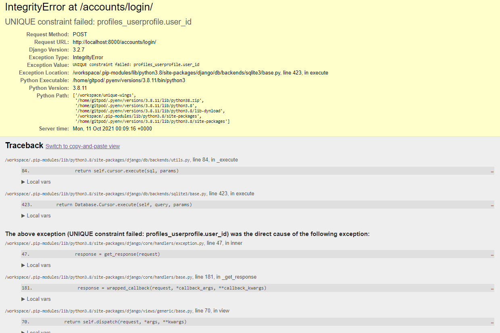
    SOLVING BY: 
    - Checking for code differences in diffchecker (came out correct),
    - Created a new superuser (still left with the same error),
    - Deleted the db.sqlite3 file in workspace, make and run migrations, loaded my fixtures for categories.json and product.json, then created a new superuser (still didn't work),
    - Checked all related files and the issue was forgotten undo uncommitted lines in models.py 
        - from
    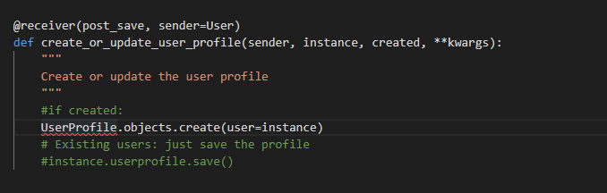
        - to
    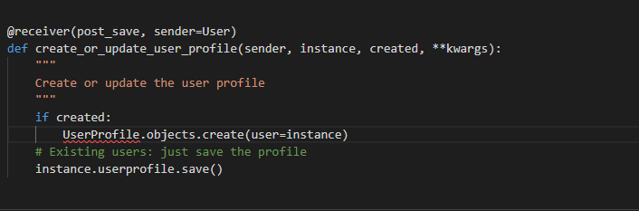

2. ERROR: while making purchases on the site and receiving an order confirmation on the profile site and success message the confirmation email doesn't appear in the terminal. Instead the error `POST /checkout/wh/HTTP/1.1 500 146184` and TemplateDoesntExist received
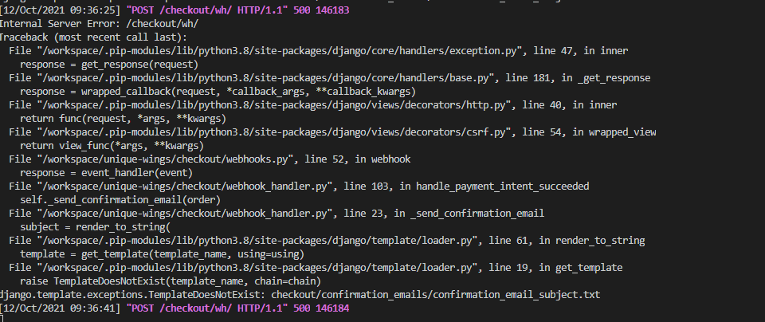
    SOLVED BY:
   - Checking for typos and correct place for **confirmation_emails** folder and webhook_handler.py
   - Checking the webhooks are correct, updating in the settings variables, and on the stripe site 
   - The error came from a typo in the `confirmation_email_subject.txt`
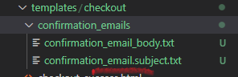

3. ERROR: While saving the comment on the "Add Comment" form the Integrity error Not Null constraint failed: blog_blogcomment.user_comment_id appeared

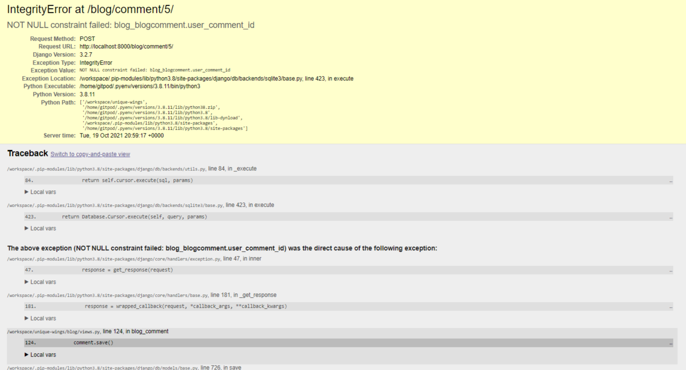

    SOLVED BY: 
    - changing in models.py BlogComment class comment values `null=True` and `blank=True`
    - wrong spelled name in the views.py `comment_user` => `user_comment`

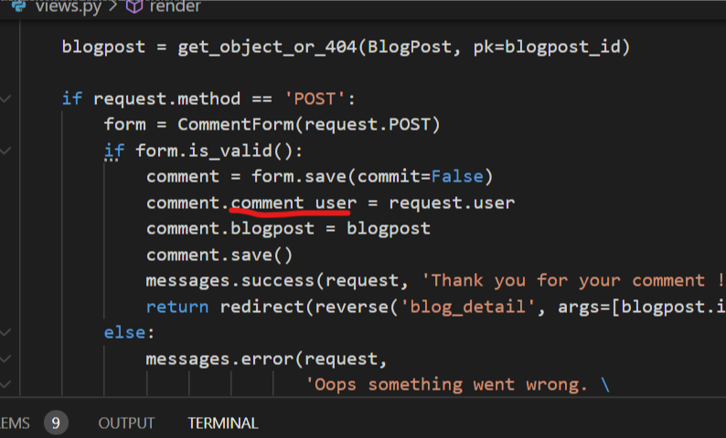

4. ERROR: While implementing modal a problem with dislayng on the screen

    SOLVED BY:
    - It was a typo in id 
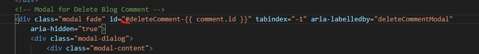

5. BUG: `Delete|Edit` buttons for comments don't hide when user is on his account is able to to see other users buttons

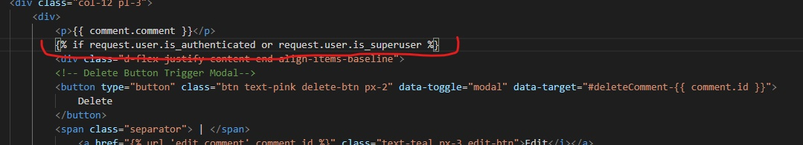
    SOLVED BY:
    - Changing if statement
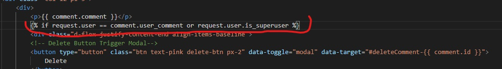
6. ISSUE: While adding the missing message field into the models.py in contact form a make-migration non-nullable firld 'message' issue appeared
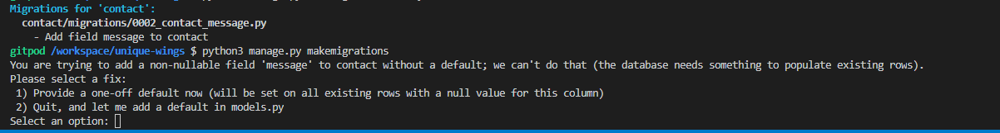

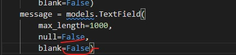

SOLVED BY: 
- value: null=False changed to null=True
- value: blank-False changed to null=True
7. ISSUE: While testing the contact form message field didn't work as expected (no validation) and also the make-migration message appeared
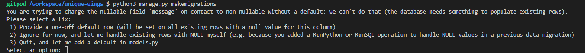
SOLVED BY: 
- in models message attribute value blank=True changed to null=False and null=True stayed the same
- before migrations database with sent emails was deleted
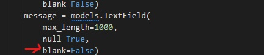
8. BUG: Input placeholders are not displayed on the Contact page as expected, default labels are enabled.
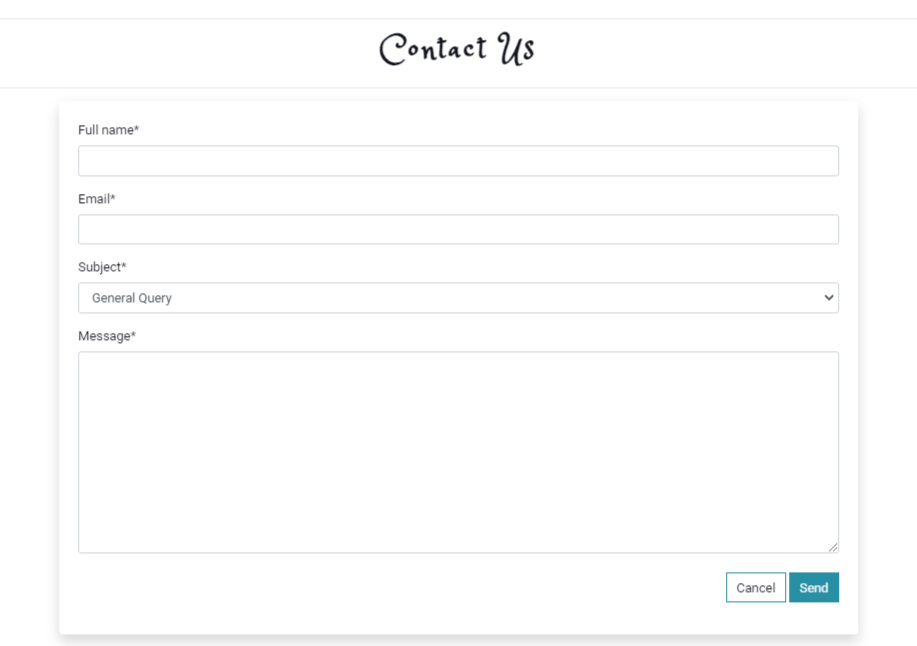

SOLVED BY:
- wrong indentation 
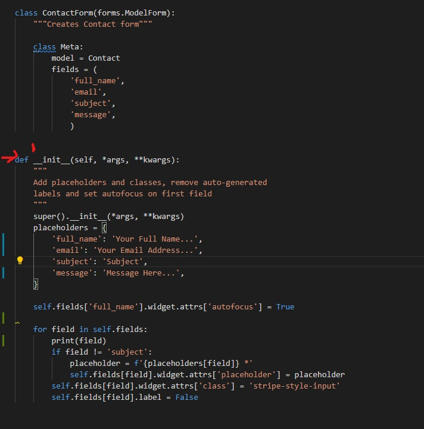
9. I encountered a few difficulties when creating a subscription app for the newsletter
    a) BUG : The newsletter-subscription form didn't display on the site 
    SOLVED BY: Forgot to add the context to the context processors in settings.py `'contexts.subscription_form',` 
    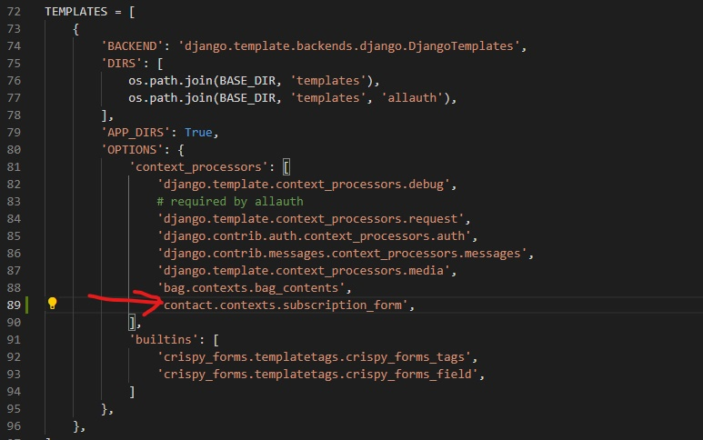
    
    b) ERROR: No Reverse Match at contact/newsletter signup 
     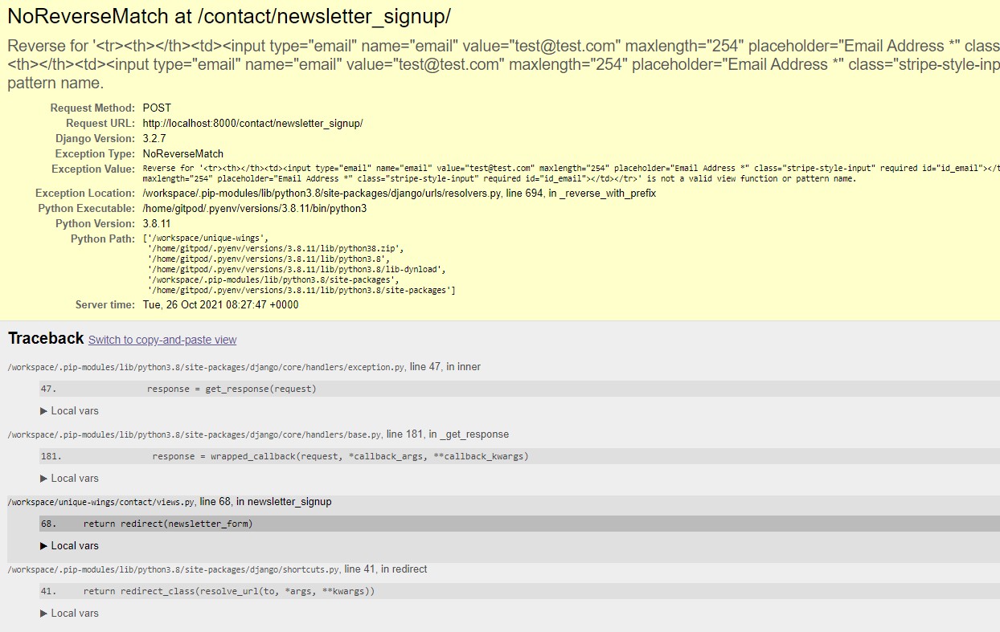
    SOLVED BY: It was wrong return 'newsletter_form' whis is a value not a URL changed to redirect_url add in footer.html in the form a hidden input field and change view to get the redirect_url from the form and then redirect it to the redirect_url
    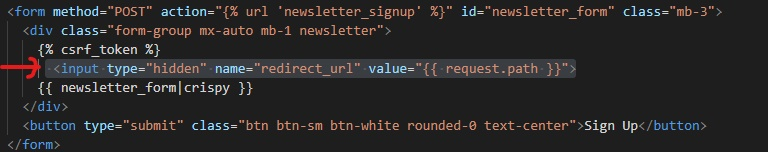
    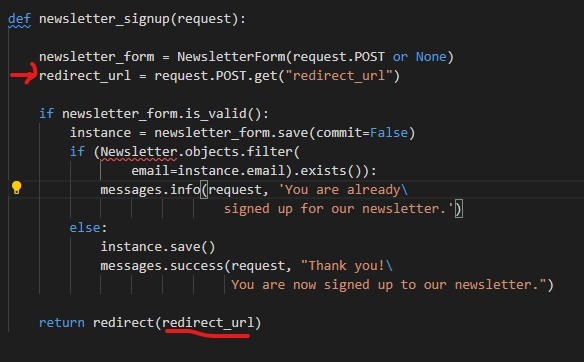
10. I encountered a few difficulties while deploying the project to heroku but main issue was: 
    a) ISSUE: logo images and hero-images  didn't appear on the on the home page
       SOLVED BY: create a new folder in static folder 'images' and moved the images from media folder to static folder
    b) ISSUE: logo butterfly image didnt wan't to display from static/imagef file
       SOLVED BY: It have to be moved back to Media folder and had to add the MEDIA_URL

    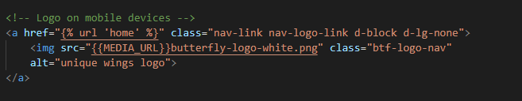

11. While creating the review application I encountered a few errors, two of which were:
    a) ERROR: NameError at products/add_review 
    SOLVED BY: Change 'User' to 'UserProfile' for model and in the views 
    form `user = User.objects.get(user=request.user)` to ` user = get_object_or_404(UserProfile, user=request.user)`
    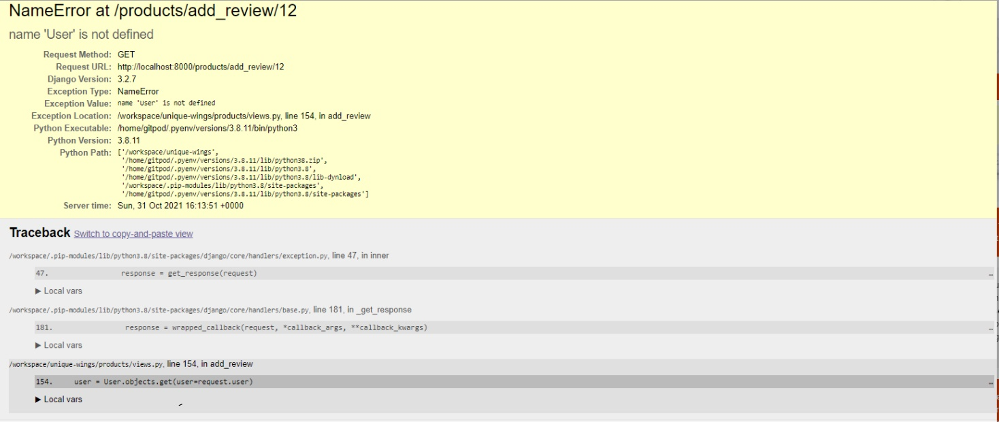

    b) ISSUE: Comments don't display on the product_detail site product. Product review object is returning from the view but didn't display data on the site.

    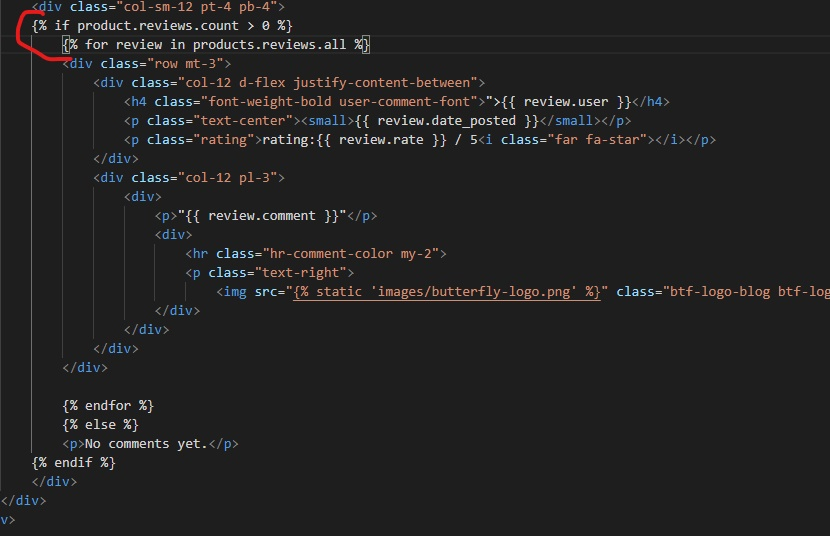

      SOLVED BY: create the if statement review that checks if there are any reviews and then loop through them. As the product review is already retrieved from DB in the view we don't need to create any association with products in the frontend like it was done previously.

    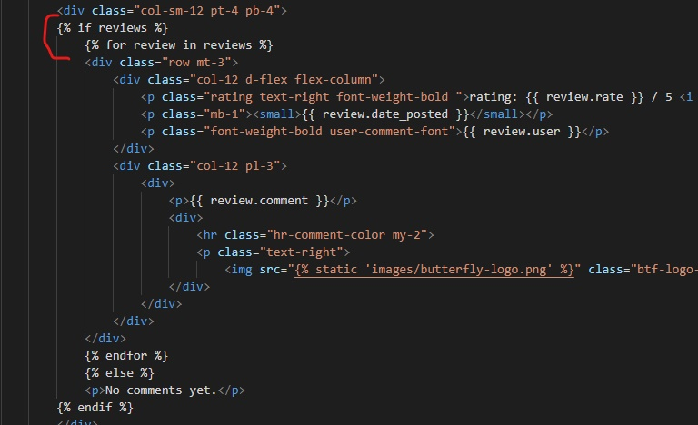
12. ISSUE: Static Files didn't upload on Heroku live website after changes on gitpod
    SOLVED BY: 
    - Changed STATICFILES_DIRS and add STATIC_ROOT to settings.py
    - Added variables to GitPod variables on settings from heroku DATABASE_URL and DEVELOPMENT set to False, make sure DEVELOPMENT doesn't exist on the Heroku config variables.
    then make sure to close and reopen workspace again for project 
    - run the command `python3 manage.py collectstatic` (staticfiles added to static folder)

    BEFORE:
    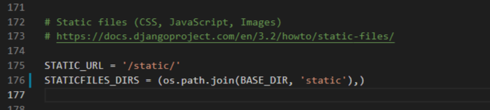
   
    AFTER:
    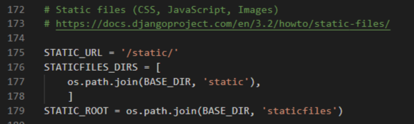

13. ISSUE: The  Review `Edit | Delete` buttons are visible only for a superuser, not for the owner of the review, and they are not able to edit or remove their reviews. 

    SOLVED BY: Initially the if statement was checking two variables that are different of types. After changes `Edit | Delete ` links will be visible to the user if they are logged in and they own the review. 
        - Make a new variavle `review_user` in the edit_review view 
        - Add to the product_detail a `review_user = None` and if statement
        - Modify if statement in a product_detail.html 
    
    BEFORE CHANGES:
    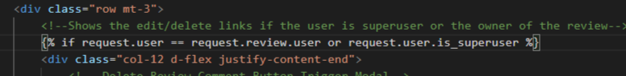
   
    AFTER CHANGES:
    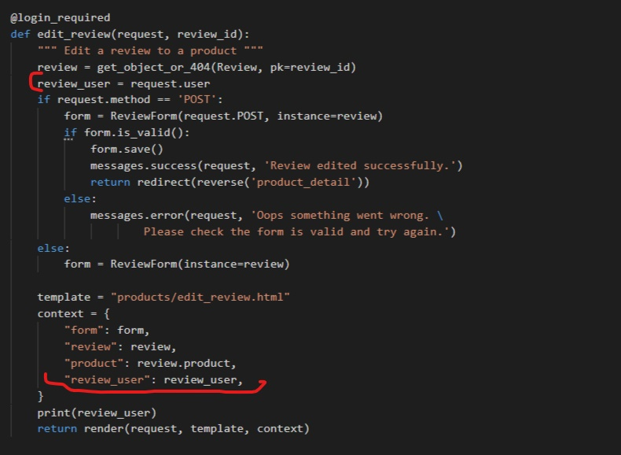
    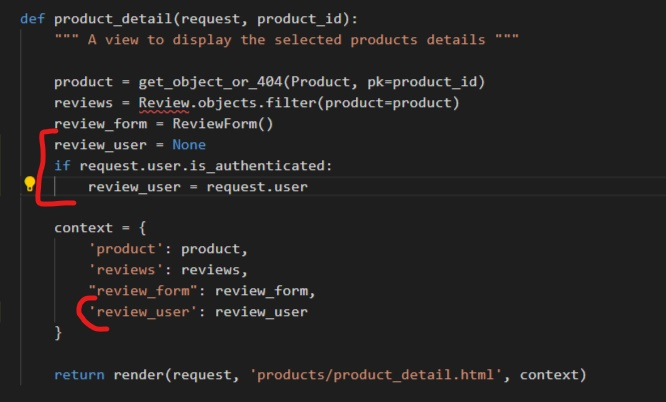
    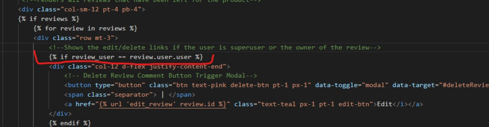

14. ISSUE: The problem with displaying and counting the average rating for each product

    SOLVED BY:

    - Add signals in the Product app, which will fire whenever the `Review` is created  for that product and register signal in apps.py
    - modify the calculate_rating method
    
    BEFORE CHANGES:
    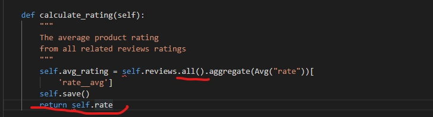
    
    AFTER CHANGES:
    - remove all() as the aggregation implies all items already
    - remove the return as the method only calculates the average rating and sets it and doesn't return anything

    

15. ERROR: While testing the sorting by: `Rating(low to high) Rating(hight to low) `future the error field appeared

    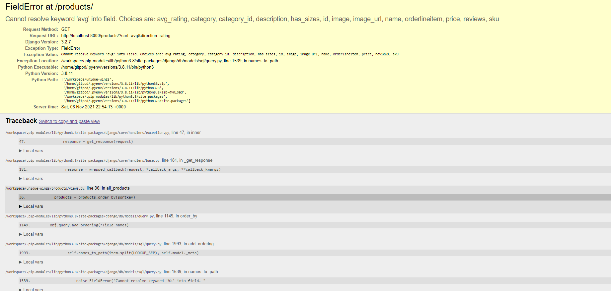

    SOLVED BY:
    - As the `rating` sortkey will only sort the non-null vs null items the new variable `subkey` is created  to sort products on the actual avg_rating.
    - The desc will invert the sortkey so it was needed to put sortkey and the subkey into the id direction statement

    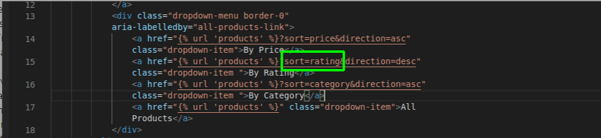
    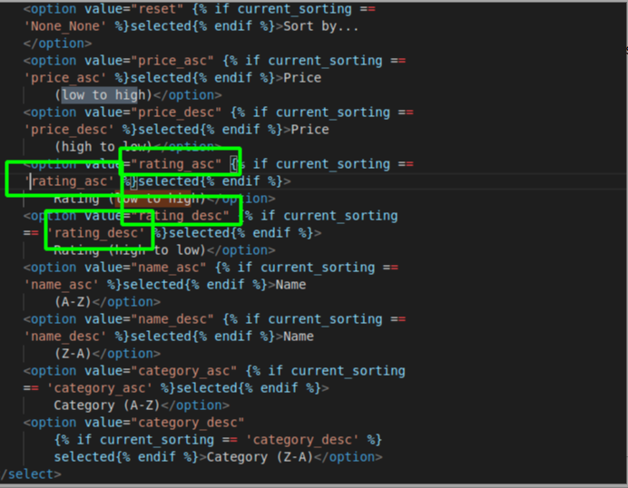
    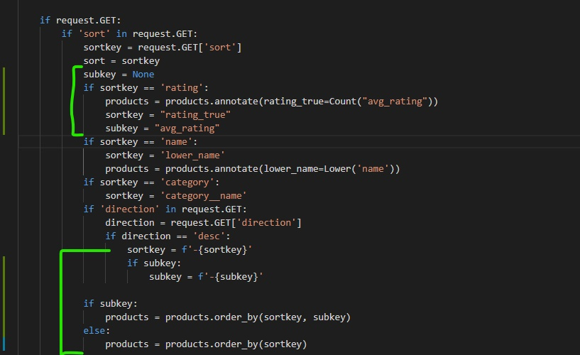

16. ERROR: While creating an order history for the user on his profile page when user is redirected to the edit form and submit the form the Name Error appeared 

    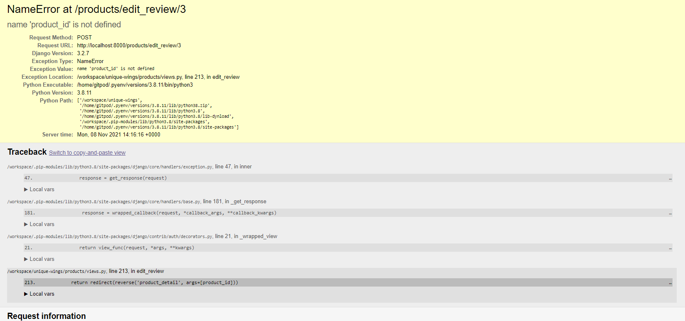

    SOLVED BY: modifying the reverse product_id argument

   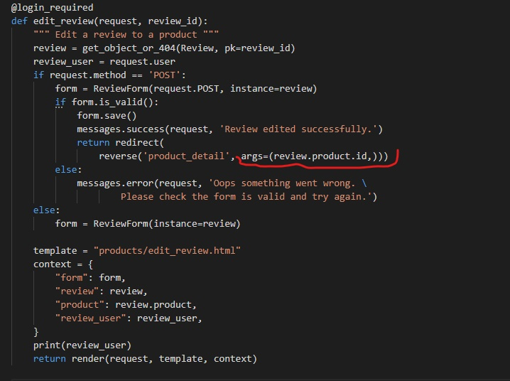

## Code Validation

### HTML Validator
1. Used [W3C Markup Validation](https://validator.w3.org/) Service HTML to validate my HTML code for all pages. Because the code is made up of Jinja templates, had to check on the site by right clicking each page, selecting View Page Source and running that generated code through the validator.

| HTML Page                                           |                      Warnings / Errors                       | Fixed |
| :-------------------------------------------------- | :----------------------------------------------------------: | ----- |
| home/base.html/main-nav.html/mobile-top-header.html | no space between attributes(space added), end tag a violets nesting rules(add 
), Cannot recover after last error (add 
), the type attribute is unnecessary for JS (removed) | PASS* |
| /accounts/login/                                    |                             None                             | PASS |
| /accounts/logout/                                   |                             None                             | PASS |
| /accounts/signup/                                   |     None       | PASS  |
| /products/                                          |      The type attribute is unnecessary for JS (removed)      | PASS |
| /products/1/                                        |      The type attribute is unnecessary for JS (removed)      | PASS  |
| /products/add/                                      |      The type attribute is unnecessary for JS (removed)      | PASS |
| /products/edit/1                                    | The type attribute is unnecessary for JS (removed), missing alt attribute (added `alt="{{ widget.name }})`, element 
 not allowed as child of <strong> element (elements swapped) | PASS |
| /reviews/add_review/1/                              |                             None                             | PASS |
| /reviews/edit/review/1/                             |                             None                             | PASS |
| /profile/                                           |      The type attribute is unnecessary for JS (removed)      | PASS |
| /profile/order_history/                             |                             None                             | PASS |
| /blog/                                              | Section lacks heading. Consider using `h2`  `h6` elements(fixed section removed), The type attribute is unnecessary for JS (removed)' | PASS  |
| /blog/1/                                            | Bad value `button` for attribute `type` on element `a` element (removed) | PASS |
| /blog/edit_blogpost/1/                              | missing alt attribute (added `alt="{{ widget.name }})`, element 
 not allowed as child of <strong> (elements swapped) element ,  | PASS  |
| /blog/comment/1/                                    |                             None                             | PASS |
| /blog/edit_comment/2/                               |                             None                             | PASS |
| /bag/                                               | Attribute`w-75` not allowed on element `hr` at this point., The type attribute is unnecessary for JS (removed) | PASS  |
| /checkout/                                          | Empty heading for loading-spinner, Duplicate ID div_id_email`, Duplicate ID `id_email` | PASS  |
| /checkout.checkout_success/                         |                             None                             | PASS |
| /contact/                                           | Attribute`w-75` not allowed on element `hr` at this point.(`<class="w-75">`) Unclosed element `div` (closed div) | PASS  |
| /newsletter_unsubscribe/                            | Attribute`w-75` not allowed on element `hr` at this point (`<class="w-75">`), | PASS  |

Home Page (base.html)
- ERRORS
    - FIXED: 
    - make the space between attributes
    - and add the closing `
` tag
    - remove `type="text/javascript"` following the [webmaserworld tip](https://www.webmasterworld.com/javascript/4879097.htm)
    - change the `id="user-options` to `id="user-options-menu` on the base template, line 94, Right Site Menu: My Account 

 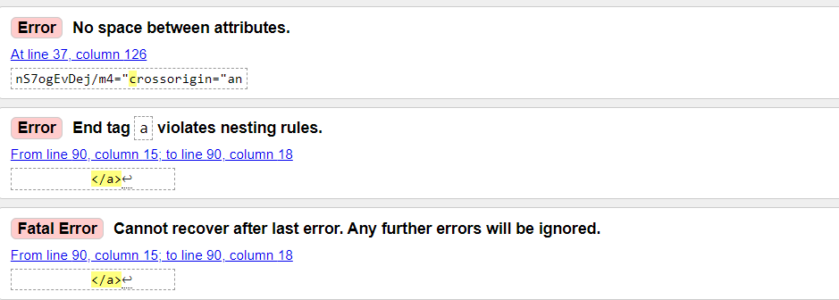

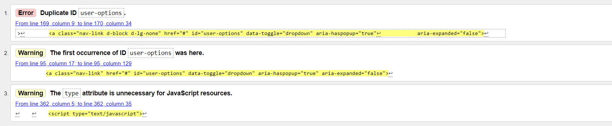

Contact

 - ERRORS

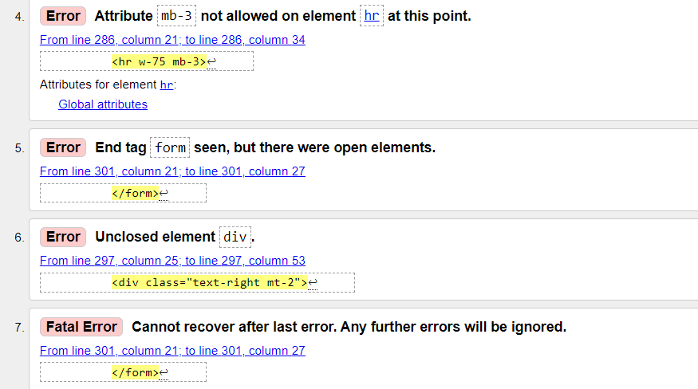

    - FIXED:
    - add closing div tag `
`
    - add class to `
` element `<class="w-75">`
 
Add product / Edit products

 - ERRORS:

  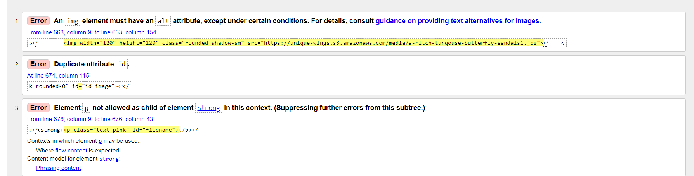

- FIXED:
    - java script `type` attribute removed
    - swap the `` , `
` tags in custom_clearable_file_input.htm places in products/templates/custom_widget_templates
    - added `alt="{{ widget.name }}` for images set dynamically in custom_clearable_file_input.htm file

Blog edit comment
- ERRORS

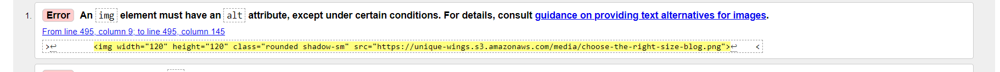

- added `alt="{{ widget.name }}` for images set dynamically in custom_clearable_file_input.htm file
- swap the `` , `
` tags in custom_clearable_file_input.htm places in products/templates/custom_widget_templates

### CSS Jigsaw Validator
Used [ jigsaw W3C CSS Validation Service](jigsaw W3C CSS Validation Service) to validate my CSS code, came out clean with no errors with 48 warnings about vendor extension
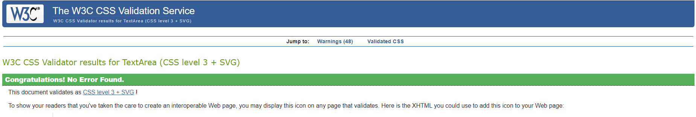

### script.js testing
used [jshint](https://jshint.com/) to validate javascript code for script.js. 

profiles>static>js>countryfield.js

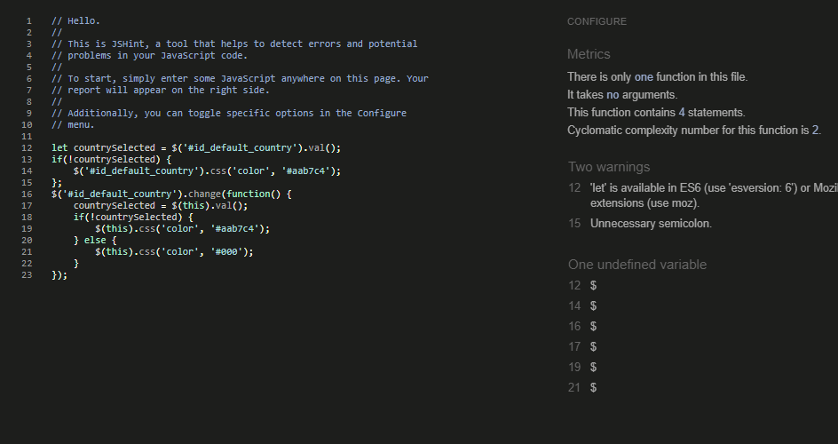

FIXED:
    - semicolon removed from line 16
    - added /*jshint esversion: 6 */

checkout > static > js > stripe_elements.js 

    - ERROR: mising semicolon line 117
    - FIXED: semicolon added

----
blog.html, 
blog_detail.html, 
bag.html (line 132, 133, 142, 156 )

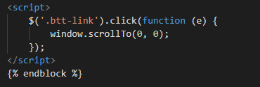

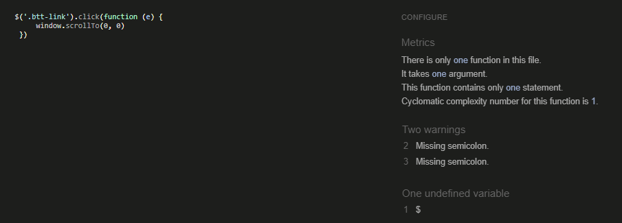

FIXED: 
- semicolons added 

### Python PEP8
Used online [PEP8](http://pep8online.com/). The entire code for every file from each application was placed in the PEP8 tool, all the errors were fixed and the end code passed the test successfully.
| app          | python file        | PASS | ERRORS/WARNINGS                                              |
| ------------ | ------------------ | ---- | ------------------------------------------------------------ |
| bag          | `apps.py`            | PASS |                                                              |
|              | `contexts.py`        | PASS |                                                              |
|              |` urls.py `           | PASS |                                                              |
|              | `views.py`           | PASS | E501 line to long (errors - 6) - added parenthesis, f'' break into lines |
| blog         | `admin.py`           | PASS |                                                              |
|              | `apps.py `           | PASS |                                                              |
|              | `forms.py `          | PASS |                                                              |
|              | `urls.py `           | PASS |                                                              |
|              | `views.py`           | PASS |                                                              |
|              | `widgets.py`         | PASS | E501 line to long (error -1) -added parenthesis, f'' break into lines |
|              | `models.py`          |      |                                                              |
| checkout     | `admin.py`           | PASS |                                                              |
|              | `apps.py `           | PASS |                                                              |
|              | `forms.py`           | PASS |                                                              |
|              | `urls.py`            | PASS |                                                              |
|              | `views.py`           | PASS | E501 line to long (errors-2) -added quotations mark and break line, added added parenthesis |
|              | `widgets.py`         | PASS |                                                              |
|              | `models.py`          | PASS | E501 line to long (errors-2) -added parenthesis, f'' break into lines  changed onto W503 - warning line break before `binary operator` |
|              | `signals.py `        | PASS | E501 line to long (errors-5) -added parenthesis, f'' break into lines |
|              | `webhook_handler.py` | PASS | E501 line to long (error-1) - move to another line           |
|              | `webhooks.py`        | PASS |                                                              |
| contact      | `admin.py  `         | PASS |                                                              |
|              | `apps.py `           | PASS |                                                              |
|              | `contexts.py`        | PASS |                                                              |
|              | `forms.py `          | PASS |                                                              |
|              | `models.py `         | PASS |                                                              |
|              | `urls.py `           | PASS |                                                              |
|              |` views.py`           | PASS |                                                              |
| home         | `apps.py`            | PASS |                                                              |
|              | `urls.py`            | PASS |                                                              |
|              | `views.py `          | PASS |                                                              |
| products     | `admin.py`           | PASS |                                                              |
|              | `apps.py `           | PASS |                                                              |
|              | `forms.py`           | PASS |                                                              |
|              |` models.py`          | PASS |                                                              |
|              |` signals.py `        | PASS |                                                              |
|              | `urls.py`            | PASS |                                                              |
|              | `views.py`           | PASS |                                                              |
|              | `widgets.py`         | PASS | E501 line to long (error-1) added parenthesis, break into lines |
| profiles     | `apps.py`            | PASS |                                                              |
|              | `forms.py`           | PASS | E501 line to long (error-1) added parenthesis, break into lines |
|              |` models.py`          | PASS |                                                              |
|              | `urls.py`            | PASS |                                                              |
|              | `views.py`           | PASS |                                                              |
| unique_wings | `settings.py`        |      | E501 line to long (error-4) unfixable                        |

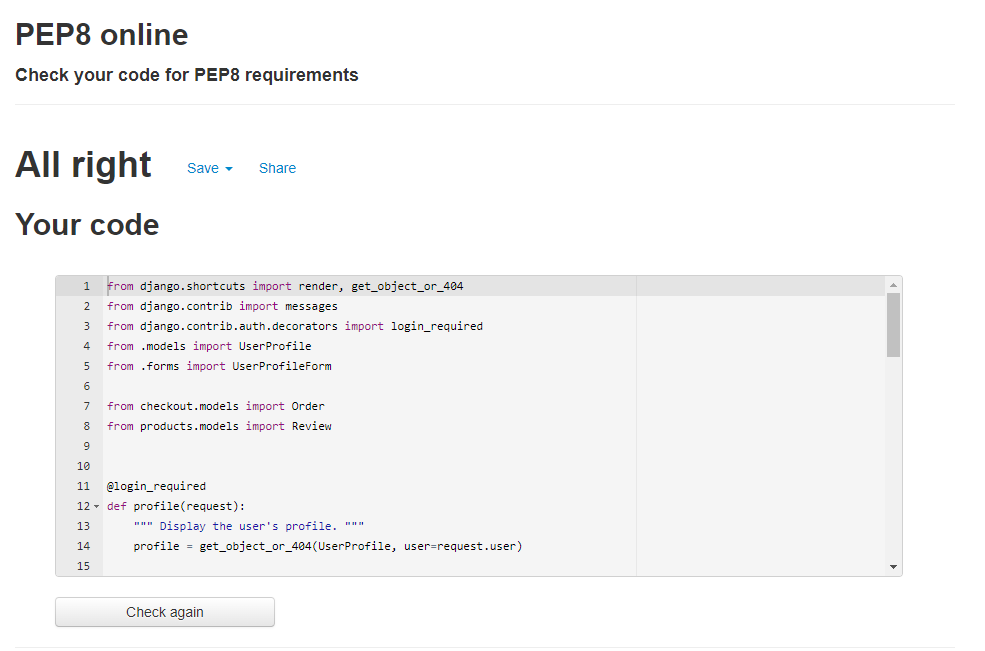

I also ran the python test command in the terminal to double check over my Python code. It all passed with no issues.

`python3 manage.py test`
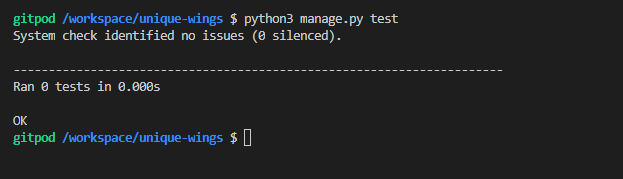

---

## Testing User Stories
---
Viewing and navigation
1. As a new user I want to be able to recognise the purpose of the site immediately, so that I can identify whether I am interested in the content and wish to use the site.
    - When the user lands on the website the welcome sign and hero images, placed on the home page gives a first glimpse on the website content and purpose.
    - The `Shop Now` button, on the middle of the website, shopping bag icon indicates what is the website's purpose.
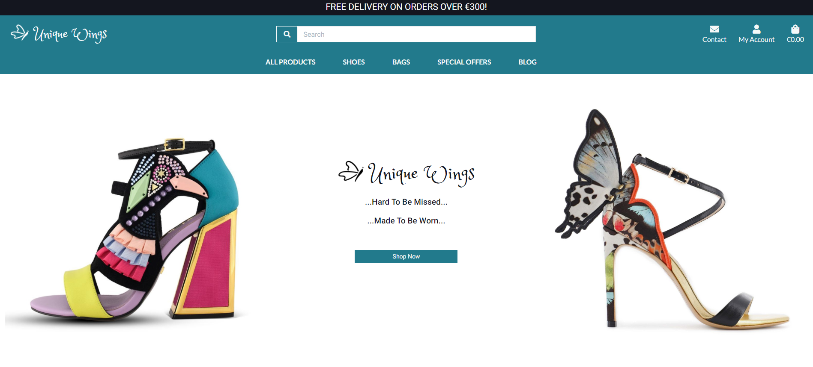  
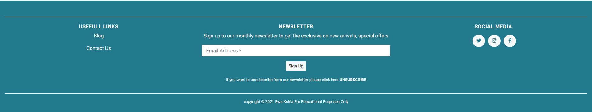 

2. As a new user I want to be able to easily navigate the site, so that I can find what I need effectively.
    - No matter what page the user lands on, they can easily find and use the navigation bar which also is set fixed, being available at all times.
    - The logo always leads back to the home page on small devices and is a butterfy on medium and large devices, with a full name logo visible for the user and also HOME link on the dropdown-menu.     

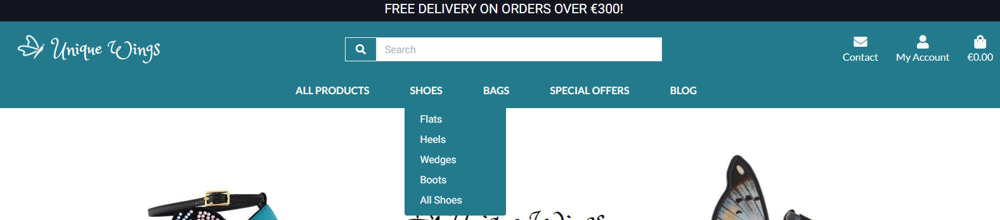  
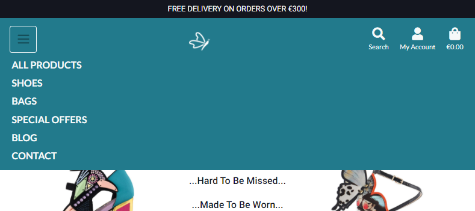  

3. As a new user I want to be able to access the website on a desktop and also mobile devices,  so that I can use it on a desktop or on the go.
    - The website is responsive and tested on various devices as well as operating systems.
    - The footer is placed relative to the bottom of each page, so users will be able to see better website, especially on small devices.

4. As a general visitor I want to be able to contact the website owner,  so that I can make a query about the product, purchase, return policy, contribute blog.
 - There is a contact link icon on the navbar and link "Contact Us" on the footer which redirects the user to the contact form
 - When the usser fills in the fields correctly the toast message will display The success message for the user.

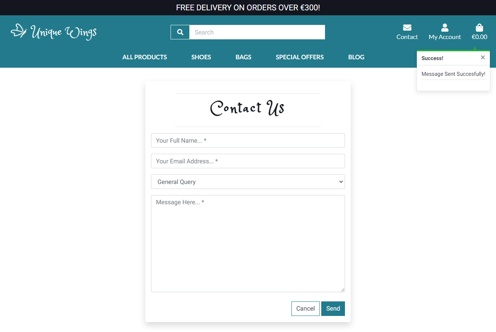 

5. As a general user I want to be able to view blogs,  so that I can get new information's about the shop, designers, fashion events, news.
 - The site contains the Blog where the users can read information about the latest collecion, feed-news, designers, fashion
 - There is a link that directs the user to the contact page if he or she wishes to contribute to the blog.
 - There is the comment section on each blog post article, where registered users are able to leave their comment.
 - There is a Review History section on "My Profile" page where users can read and edit their blog comments.

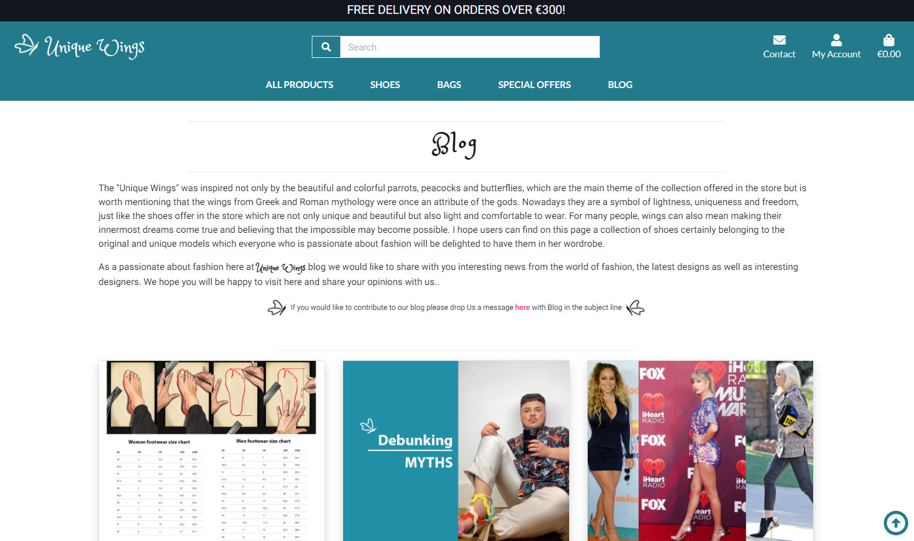 

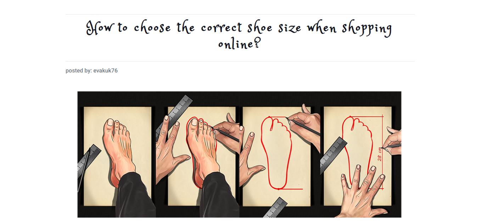 

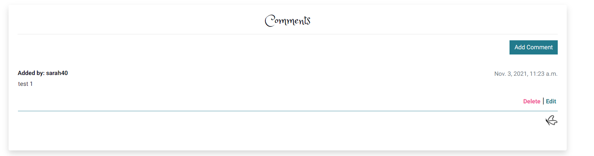 

6. As a new user and future shopper I want to be able to view a list of products, so that I can find which product I'd like to purchase.

 -  The site contains links on the navigation bar with individual categories and sub-categories, where the user has the option to choose the product they are interested in.
 - There is a dropdown menu with sub-categories for ALL Products, Shoes, Bags, Special Offers when a user is able to choose product they are interested in.

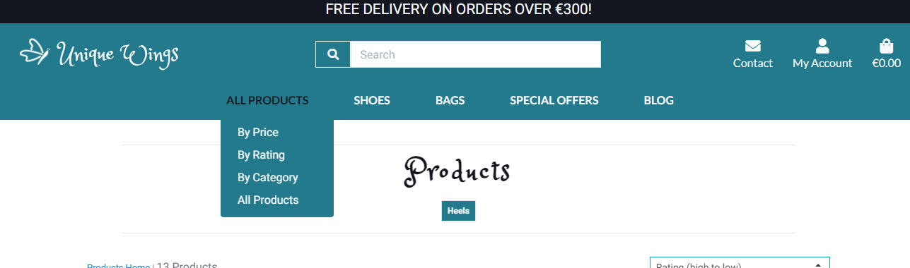 

7.  As a new user and future shopper I want to be able to view individual product details,  so that I can identify the price, description, shoes rating,  image and available sizes before deciding to purchase.
- Each product on the page, after clicking on the picture, redirects the user to the detail product, where detailed information as well as comments and rating of the products are provided.
- Once the user clicks on the picture of the product it will be displayed in large format in a separate window.
- Registered users have the ability to add/edit/delete comment and ratings to the product, which are automatically calculated and average rate displayed in the product description.

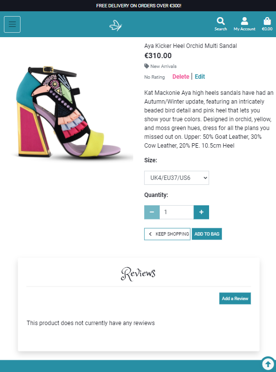 

8. As a new user and future shopper I want to be able to quickly identify sales, promotions and special offers, so that I can take advantage of special savings on products I'd like to purchase.
- The website has a SPECIAL OFFERS drop-down menu where the user can find Sales and New Arivals

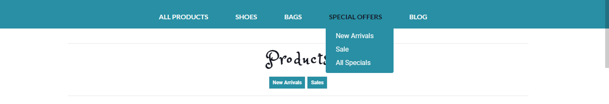 

9. As a new user and future shopper I want to be able to easily view the total of my purchases at any time,  so that I can avoid spending too much.
-  On the right site of the navbar there is a Shopping Bag which updates a total price each time the user adds a new product, and have information free delivery and "Go to secure checkup" button. 
-  Shopping bag change color to pink when user adds his first product to indicate there is an item in the bag.
- Once the user clicks on the Shopping bag, he will be redirected to a Shopping bag page where he view the items, change quantity, remove from the bag or process to the secure checkup.
- The success toast will display on the site every time users add a new product in the bag.

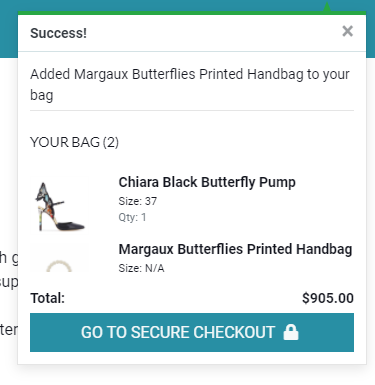 
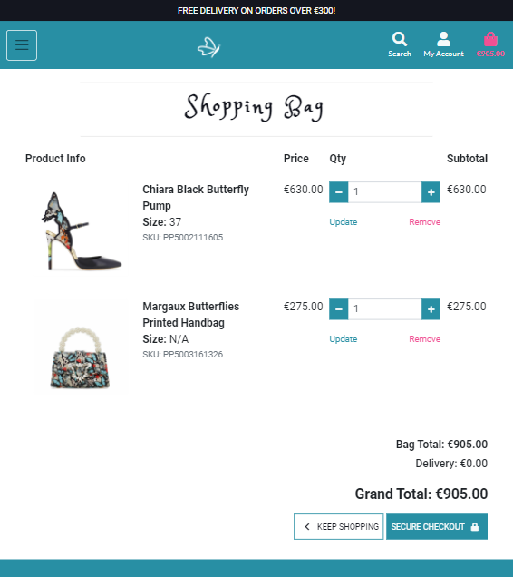 

**Registration and User Accounts** 
10. As a new user and future shopper I want to be able to easily register for an account,  so that I can have a personal account and be able to view my profile.  
- From the navigation bar a new user is able to go to the "My Account" dropdown menu where the user can choose the Register button and he will be redirected to the "Sign Up" page. 
- The Sign up form contains username, email address and password. User needs to confirm email address and password.  
- If the user enters incorrect data, he will be informed about it. If the form is completed correctly, the user will be informed about it with the success toast and will be redirected to the page, where he will be informed about the verification of his e-mail and a follow-up link will be sent to his inbox.

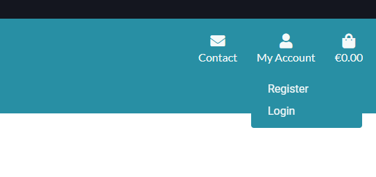 
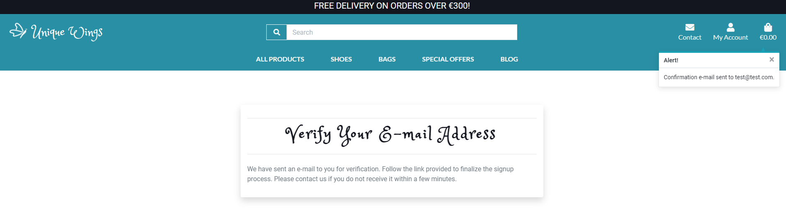 
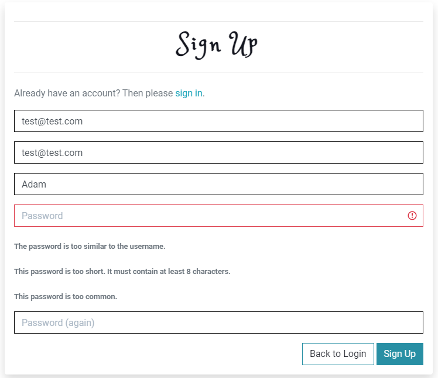 

11. As a registered user I want to be able to easily login/out,  so that I can access my personal account information.    
-  From the navigation bar a new user can to go to the "My Account" dropdown menu where the user can choose the Login link and he will be redirected to the "Sign in" page.
- On the "Sign in" page users are asked to enter their email or username and password. If they completed the form correctly, they will be informed by toast success about a successful login into their account.
- Once a user is logged into their account, he / she has access to their My profile/Logout links from the "My Account " dropdown menu.

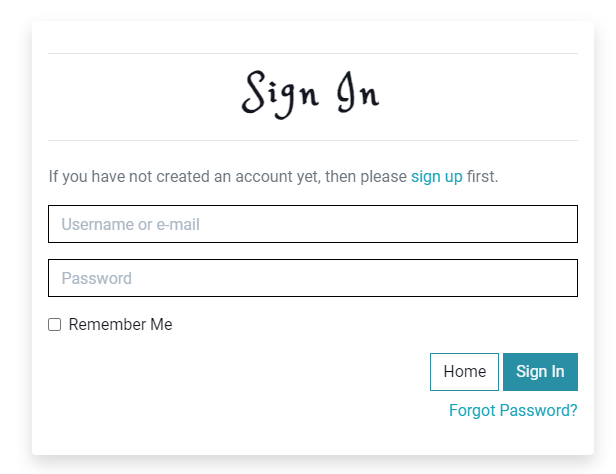 

12. As a registered user I want to be able to easily reset my password in case I forget it,  so that I can recover  access to my account if I have forgotten my password. 
- On the "Sign in" page there is a link under "Sign In" button "Forgot password", which redirects the user to the "Password Reset" page. The user is asked to enter their email address and press the "Reset My Pasword" button. User will receive the recover password message in their email.

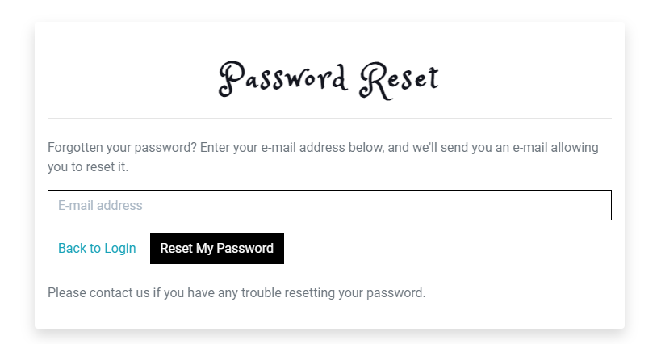 

13. As a registered user I want to be able to receive an email confirmation after registering,  so that I can verify that my account registration was successful. 
- Once a user is registered, he will receive a confirmation email with a verification link in their account. 

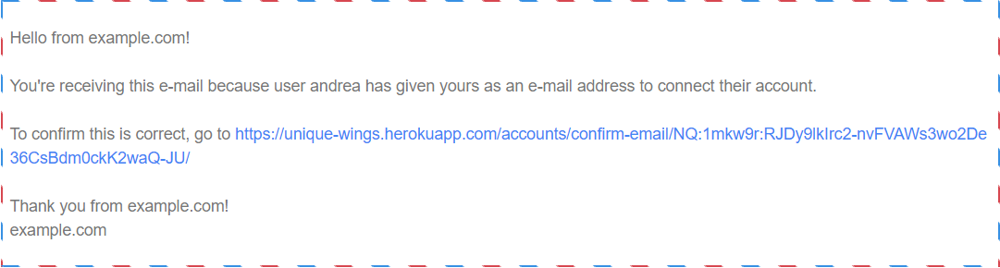 
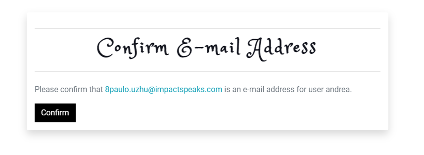 

14. As a  registered user I want to be able to have a customized dashboard, so that I can view my personal order history and order confirmation, and save my payment information.
- On "My profile" page users can access, view and edit delivery information, order history and review history.

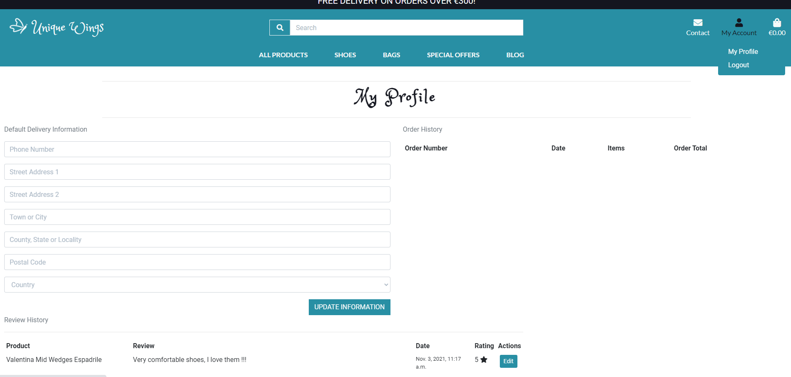 

**Sorting and searching**  
15. As a shopper I want to be able to sort the list of available products,  so that I can	easily identify the best rated, best priced and categorically sorted products.
- There is a searchbox on the navigation bar where user can search depending on the entered keyword.
- On the product page there is a search bar, where the user can search for products in the selected category depending on the price, rating, name and category.

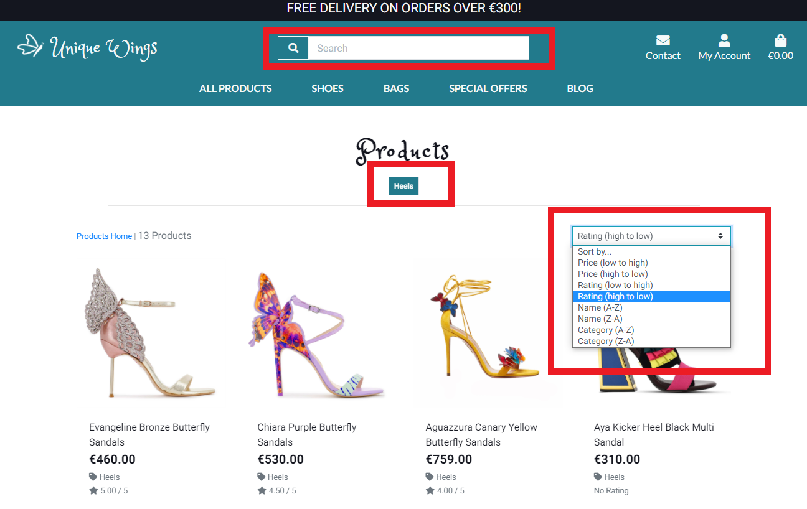 

16. As a shopper I want to be able to sort multiple categories of products simultaneously, so that I can find the best-priced or best-rated products across broad categories, such as "high hills" , "flats", "boots".
- On the navigation bar there is a dropdown list for both categories SHOES and BAGS, where a user is able to chose interesting categories and sort chosen products on the search box depending on price or rate.

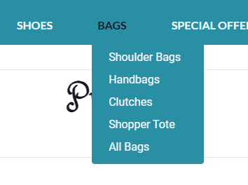
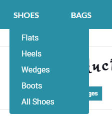
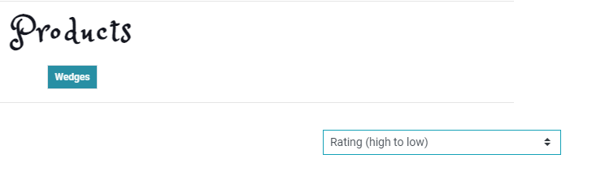

17. As a shopper I want to be able to search for a product by name or description, so that I can find a specific product I'd like to purchase.
- There is a searchbox on the navigation bar where a user can search depending on the entered keyword.

18. As a shopper I want to be able to Easily see what I've searched for and the number of results, so that I can Quickly decide whether the product I want is available. 
- Once the product is chosen it is displayed on the site with an image, name, price, category and rating
and the number of results is displayed on the left site of the page.

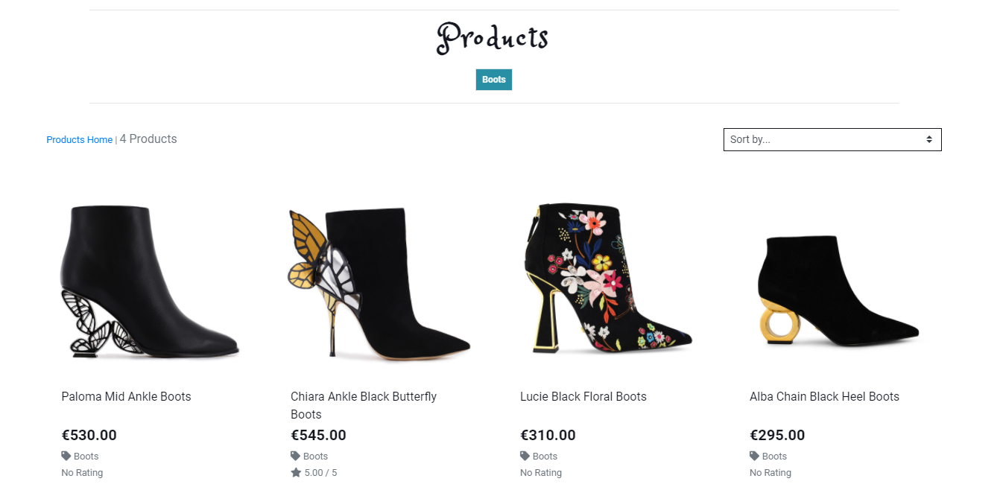

**Purchasing the checkout**
19. As a shopper I want to be able to easily select the size and quantity of a product when purchasing it, so that I can Ensure I don't accidentally select the wrong product, quantity or size.

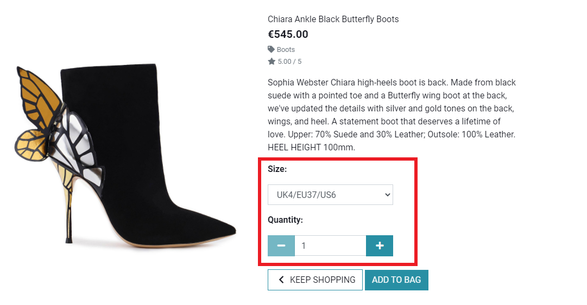

20. As a shopper I want to be able to view details about the items in my shopping bag,  so that I can decide if I want to purchase an item or edit it.
- Once the user clicks on the shopping bag he will be redirected to the "Shopping Bag" page where he is able to view/edit/delete/purchase the products in his bag.
- Users doesn't need to be logged in to view their bag or go to secure checkout.

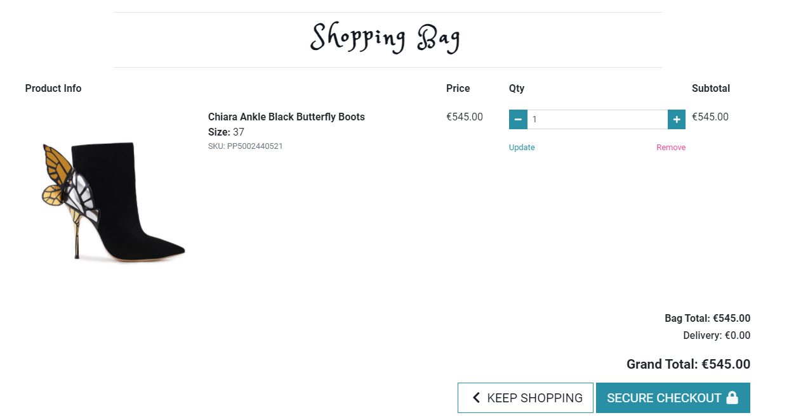

21. As a shopper I want to be able to easily add, edit & delete items in my shopping bag,  so that I can adjust my total to fit into my budget.
- On the Shopping bag page there are links "Update" and "Remove" which allow user to edit or delete product.
- On the detail product page each page contains the "ADD TO BAG" button.

22. As a shopper I want to be able to revisit my shopping cart after logging in and logging out,  so that I can complete my purchase without re-adding every single item.
- Once the products are added to the shopping bag, they are saved, so the user can revisit their profile any time and finish his secure checkout.

23. As a shopper I want to be able to checkout using credit/debit cards,  so that I can purchase chosen products.
- Once the user chose the secure checkup button he will be redirected to the "Checkout page, where a user is able to use credit cards to purchase products.
- 'Allauth' provides a robust user account system while Stripe offers secure payments, furthered by use of webhooks to ensure transactions are recorded.
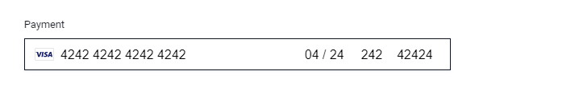

24. As a shopper I want to be able to receive my digital order via email,  so that I can access the item I just purchased.
- Once the user purchases the product they ordered, the confirmation email is sent to the user email box. 
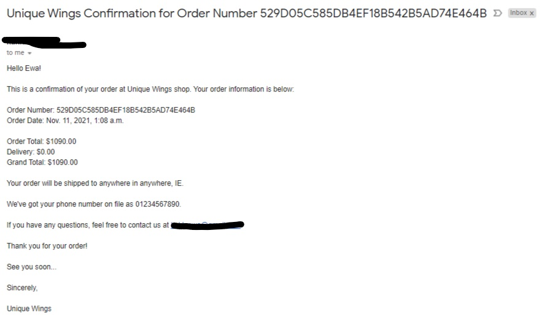

**Navigation**  
25. As a site owner I want to be able to access product management from the homepage, so that I can access my account.
- On the navigation bar once the superuser/admin is logged in, has access to the Product Management and Blog Management
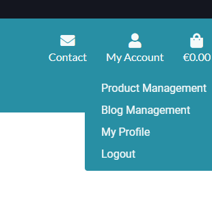

26. As a site owner I want to be able to access my dashboard from the homepage,  so that I can return to my dashboard at any time.
- On the navigation bar there is an icon "My Account" with all the necessary links, which are visible after the administrator logs in.

27. As a site owner I want to be able to receive a notification when there is a pending order, so that I can know when I am making money.
- Once the item is purchased, the confirmation email is sent to the user and the site owner.

**Product management/Blog management**

28. As a site owner I want to be able to add new products, so that I can add new items to my online store.
- Once a site owner is logged in, he has access to the Product Management link from "My Account" dropdown menu. The admin will be redirected to the Product page where he can add a new product/blogpost. 

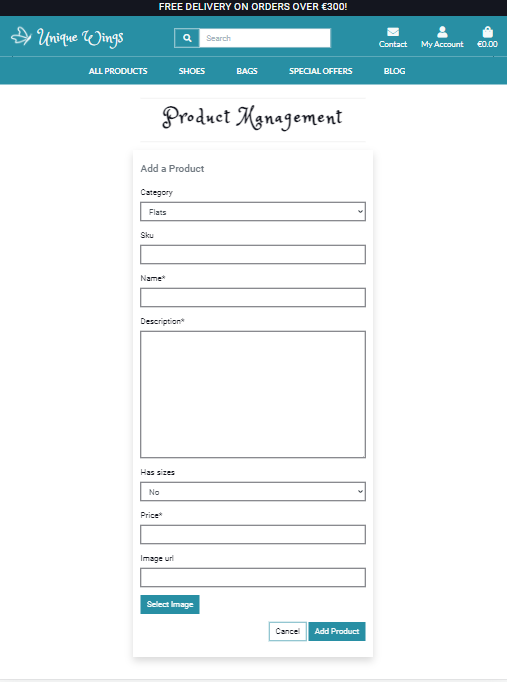

29. As a site owner I want to be able to edit/update products, so that I can update products prices, descriptions, images and other product criteria.

- Once a site owner is logged, they has access to the Edit button on each product placed on each product. The user will be redirected to the "Product management" page where he can update product details.
- The toast Alert message will display to inform Admin about editing the product.

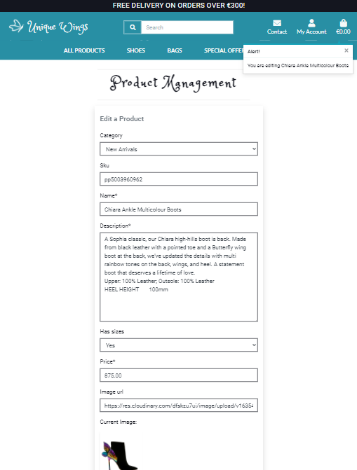

30. As a site owner I want to be able to delete products, so that I can remove erroneous products or products that are no longer available.
- Once a site owner is logged in, he / she has access to the "Delete" button on each product. The user will be redirected to the "Product management", page where he can remove the product from the database.
- The modal Alert message will display to confirm Admin about deleting the product.

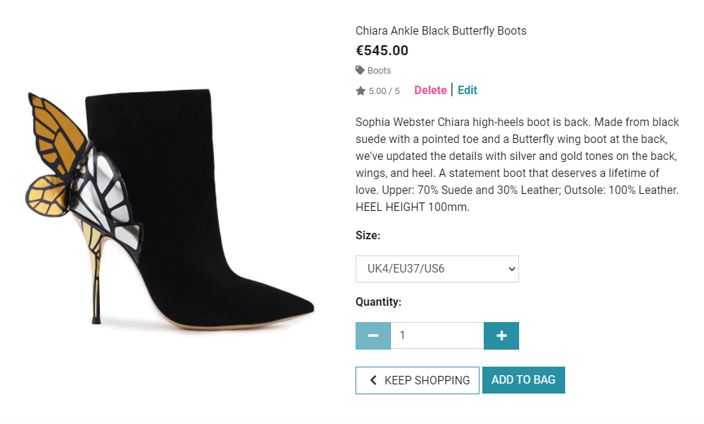
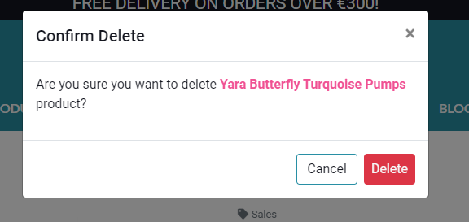

31. As a site owner I want to be able to add blog post,  so that I can add new posts to their blog.
- Once a site owner is logged in ,he she has access to the Blog Management. The admin will be redirected to the Blog Management page where he can add a new blogpost.

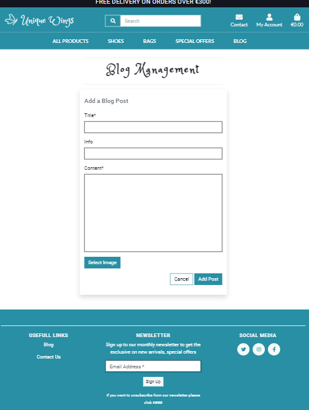

32. As a site owner I want to be able to Edit/Update a blog post,  so that I can change post name, content, and image.
- Once a site owner is logged in, he / she has access to the EDIT link placed on each blogpost.
- There is a Review History section on "My Profile" page where a site owner can read and edit blog comments.

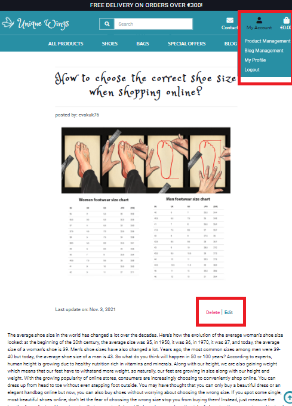

33. As a site owner I want to be able to Delete a blog post,  so that I can remove a blog post.
- Once a site owner is logged in, he / she has access to the  Delete link placed on each blogpost.

 **Authentication & Account**    

34. As a site owner I want to be able to verify my email address, so that I can set up my account securely.
- The site owver is able to access the database by adding the "/admin" to the end of URL where he is able to verify his account , change securely his email address and manage the store from the backend.
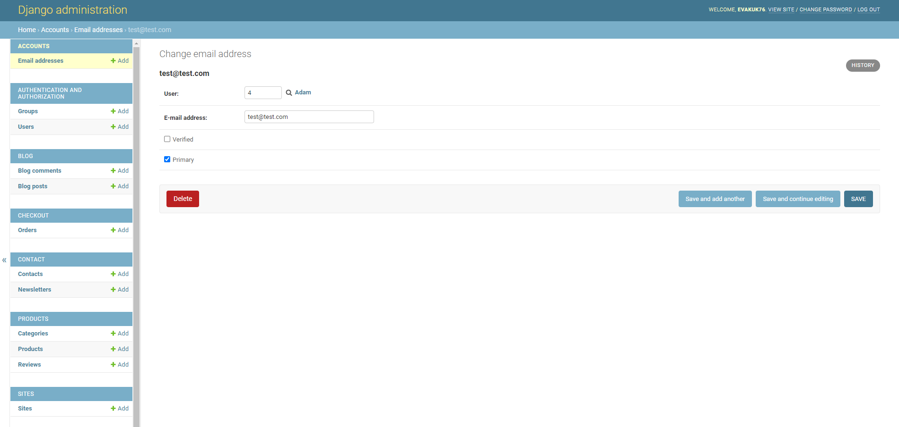 

35. As a site owner I want to be able to update my account information,  so that I can maintain access to my account.
- Once a site owner is logged in, he / she has access to the "My Profile" link from where he is able to edit and update the account information. 
 

36. As a site owner I want to be able to logout when I am finished with my work, so that I can logout of my account.
- On the "My account" dropdown menu where site user can Logout of his account. 

37. As a site owner I want to be able to reset my password, so that I can recover my account or upgrade its security.
- On the "Sign in" page there is a link under "Sign In" button "Forgot password", which redirects the user to the "Password Reset" page. The user is asked to enter his email address and press the "Reset My Pasword" button. User will receive the recover password message in their email.

 

## Testing Functionality

# HOME PAGE base.html/index.html

| Element                            | Sub-categories     | Action            | Expected Result                                              | PASS/FAIL | PROBLEM | FIX  |
| ---------------------------------- | ------------------ | ----------------- | ------------------------------------------------------------ | :-------: | ------- | ---- |
| **Navbar** -desktop                |                    |                   |                                                              |           |         |      |
| Logo "Unique Wings"                |                    | Click             | Redirect to home page/ change color to black/                | **PASS**  |         |      |
| All products  dropdown menu Link   |                    | Click             | Each link changes colour to black on hover, sort within the All products category and display products according  to the chosen sub-category: | **PASS**  |         |      |
|                                    | By price           | Click             | Sorts products By price low to high                          | **PASS**  |         |      |
|                                    | By Rating          | Click             | Sorts products By Rating High to low                         | **PASS**  |         |      |
|                                    | By Category        | Click             | Sorts products Category Alphabetically A-Z                   | **PASS**  |         |      |
|                                    | All products       | Click             | Displays All products within All Products category           | **PASS**  |         |      |
| Shoes Dropdown menu link           |                    | Click             | Each link changes colour to black on hover, sorts within the Shoes category and display products according  to the chosen sub-category: | **PASS**  |         |      |
|                                    | Flats              | Click             | Sorts Flats within Shoes category                            | **PASS**  |         |      |
|                                    | Heels              | Click             | Sorts Heels within Shoes category                            | **PASS**  |         |      |
|                                    | Wedges             | Click             | Sorts Flats Wedges Shoes category                            | **PASS**  |         |      |
|                                    | Boots              | Click             | Sorts Boots within Shoes category                            | **PASS**  |         |      |
|                                    | All shoes          | Click             | Dysplays All shoes within Shoes category                     | **PASS**  |         |      |
| Bags page Dropdown menu link       |                    | Click             | Each link changes colour to black on hover, sorts within the Bags category and display products according  to the chosen sub-category: | **PASS**  |         |      |
|                                    | Shoulder bag       | Click             | Sorts Shoulder Bag within Bags category                      | **PASS**  |         |      |
|                                    | Handbag            | Click             | Sorts Handbag within Bags category                           | **PASS**  |         |      |
|                                    | Clutches           | Click             | Sorts Clutches within Bags category                          | **PASS**  |         |      |
|                                    | Shopper Totes      | Click             | Sorts Shopper Totes within Bags category                     | **PASS**  |         |      |
|                                    | All Bags           | Click             | Displays All Bags within Bags category                       | **PASS**  |         |      |
| Special Offer Dropdown menu link   |                    | Click             | Each link changes colour to black on hover, sorts within the Special Offers category and display products according  to the chosen sub-category: | **PASS**  |         |      |
|                                    | New Arrivals       | Click             | Sorts New Arrivals within Special Offers Categorry           | **PASS**  |         |      |
|                                    | Sale               | Click             | Sorts Shoes on Sale within Special Offers Category           | **PASS**  |         |      |
|                                    | All Specials       | Click             | Displays All Specials within Special Offers Category         | **PASS**  |         |      |
| Blog  Link                         |                    | Click             | Redirect to Blogpage                                         | **PASS**  |         |      |
| Contact  Link                      |                    | Click             | Redirect to Contact page                                     | **PASS**  |         |      |
| My Account page Dropdown menu link |                    | Click             | Each link changes colour to black on hover, sorts within the Bags category and display products according  to the chosen sub-category: | **PASS**  |         |      |
|                                    | Product Management | Click             | (Only visible if admin in session), Redirect to Product Management page | **PASS**  |         |      |
|                                    | Blog Management    | Click             | (Only visible if admin in session), Redirect to Blog Management page | **PASS**  |         |      |
|                                    | My Profile         | Click             | (Only visible if admin or user logged in)                    | **PASS**  |         |      |
|                                    | Login              | Click             | Redirect to Sign In page (Not visible if admin or user  logged in) | **PASS**  |         |      |
|                                    | Logout             | Click             | Redirect to Sign Out page, Log Out user out of Profile (Only visible if admin or user  logged in) | **PASS**  |         |      |
|                                    | Register           | Click             | Redirect to Sign Up page (Not visible if admin or user logged in) | **PASS**  |         |      |
| Shopping Bag                       |                    | Click             | Redirect to Shopping Bag page, Changes colour to black on hover when empty to pink when product is added, | **PASS**  |         |      |
| Search Box                         |                    | Click + searchkey | Sort Products within the keyword and display on the site with the product number (name,designer,color, description etc.) eg. webster, gold, chiara, | **PASS**  |         |      |
| **NavBar** mobile                  |                    |                   |                                                              |           |         |      |
| Butterfly Logo                     |                    | Click             | Redirect to Home Page                                        | **PASS**  |         |      |
| Search icon                        |                    | Click+searchkey   | Open search box, Sort Products within the keyword and display on the site with the product number (name,designer,color, description etc.) eg. webster, gold, chiara, | **PASS**  |         |      |
| Search box empty                   |                    |                   | Error toast "You didn't enter any search criteria"           | **PASS**  |         |      |
| Search box no result               |                    |                   | 0 products found for "....." message displayed on the site   | **PASS**  |         |      |
| My Account page Dropdown menu link |                    | Click             | Each link changes colour to black on hover, sorts within the Bags category and display products according  to the chosen sub-category: | **PASS**  |         |      |
|                                    | Product Management | Click             | (Only visible if admin logged in), Redirect to Product Management page | **PASS**  |         |      |
|                                    | Blog Management    | Click             | (Only visible if admin logged in), Redirect to Blog Management page | **PASS**  |         |      |
|                                    | My Profile         | Click             | (Only visible if admin or user logged in)                    | **PASS**  |         |      |
|                                    | Login              | Click             | Redirect to Sign In page (Not visible if admin or user  logged in) | **PASS**  |         |      |
|                                    | Logout             | Click             | Redirect to Sign Out page, Log Out user out of Profile (Only visible if admin or user logged in) | **PASS**  |         |      |
|                                    | Register           | Click             | Redirect to Sign Up page (Not visible if admin or user  logged in) | **PASS**  |         |      |
| Shopping Bag                       |                    | Click             | Redirect to Shopping Bag page, Changes colour to black on hover when empty to pink when product is added, | **PASS**  |         |      |
| Hamburger Icon                     |                    | Click             | Open Side nav                                                | **PASS**  |         |      |
| Home Dropdown                      |                    | Click             | Redirect to Home Page                                        | **PASS**  |         |      |
| All Products Dropdowan             | By price           | Click             | Sorts products By price low to high                          | **PASS**  |         |      |
|                                    | By Rating          | Click             | Sorts products By Rating High to low                         | **PASS**  |         |      |
|                                    | By Category        | Click             | Sorts products Category Alphabetically A-Z                   | **PASS**  |         |      |
|                                    | All products       | Click             | Displays All products within All Products category           | **PASS**  |         |      |
| Shoes dropdown                     | Flats              | Click             | Sorts Flats within Shoes category                            | **PASS**  |         |      |
|                                    | Heels              | Click             | Sorts Heels within Shoes category                            | **PASS**  |         |      |
|                                    | Wedges             | Click             | Sorts Flats Wedges Shoes category                            | **PASS**  |         |      |
|                                    | Boots              | Click             | Sorts Boots within Shoes category                            | **PASS**  |         |      |
|                                    | All shoes          | Click             | Dysplays All shoes within Shoes category                     | **PASS**  |         |      |
| Bags dropdown                      | Shoulder bag       | Click             | Sorts Shoulder Bag within Bags category                      | **PASS**  |         |      |
|                                    | Handbag            | Click             | Sorts Handbag within Bags category                           | **PASS**  |         |      |
|                                    | Clutches           | Click             | Sorts Clutches within Bags category                          | **PASS**  |         |      |
|                                    | Shopper Totes      | Click             | Sorts Shopper Totes within Bags category                     | **PASS**  |         |      |
|                                    | All Bags           | Click             | Displays All Bags within Bags category                       | **PASS**  |         |      |
| Special Offers dropdown            | New Arrivals       | Click             | Sorts New Arrivals within Special Offers Categorry           | **PASS**  |         |      |
|                                    | Sale               | Click             | Sorts Shoes on Sale within Special Offers Category           | **PASS**  |         |      |
|                                    | All Specials       | Click             | Displays All Specials within Special Offers Category         | **PASS**  |         |      |
| Blog  Link                         |                    | Click             | Redirect to Blogpage                                         | **PASS**  |         |      |
| Contact  Link                      |                    | Click             | Redirect to Contact page                                     | **PASS**  |         |      |
| Shop Now button                    |                    | Click             | Redirect to Products page                                    | **PASS**  |         |      |
|                                    |                    |                   |                                                              |           |         |      |
| **Footer**                         |                    |                   |                                                              |           |         |      |
| Usefull Links                      |                    |                   |                                                              |           |         |      |
| Blog                               |                    | Click             | Redirect to Blogpage                                         | **PASS**  |         |      |
| Contact Us                         |                    | Click             | Redirect to Contact Us page                                  | **PASS**  |         |      |
| Newsletter box + Sign Up button    |                    | email + click     | Information message when wrong email                         | **PASS**  |         |      |
|                                    |                    |              | Access to the Newsletter from all the pages                     |   **PASS** |          |       |
|                                    |                    |                   | Success toast when email correct and signed up succesful     | **PASS**  |         |      |
|                                    |                    |                   | email in the database on the admin site                      | **PASS**  |         |      |
| Social Media                       |                    |                   |                                                              |           |         |      |
| Twitter Link                       |                    | Click             | Open on external page                                        | **PASS**  |         |      |
| Instagram Link                     |                    | Click             | Open on external page                                        | **PASS**  |         |      |
| Facebook Link                      |                    | Click             | Open on external page                                        | **PASS**  |         |      |

# PRODUCTS PAGE products.html

| Element                      | Additional            | Action                    | Expected Result                                              | PASS/FAIL | PROBLEM | FIX  |
| ---------------------------- | --------------------- | ------------------------- | ------------------------------------------------------------ | :-------: | ------- | ---- |
| **Products**                 |                       |                           |                                                              |           |         |      |
| **Sort By box**              |                       | choose from dropdown list | Sorts products within displayed subcategory eg. Heels, Wedges ect. |           |         |      |
|                              | Price (low to high)   |                           | Sorts products within the given category                     | **PASS**  |         |      |
|                              | Price (high to low)   |                           | Sorts products within the given category                     | **PASS**  |         |      |
|                              | Rating (low to high)  |                           | Sorts products within the given category                     | **PASS**  |         |      |
|                              | Rating  (high to low) |                           | Sorts products within the given category                     | **PASS**  |         |      |
|                              | Name (A-Z)            |                           | Sorts products within the given category                     | **PASS**  |         |      |
|                              | Name (Z-A)            |                           | Sorts products within the given category                     | **PASS**  |         |      |
|                              | Category (A-Z)        |                           | Sorts products within the given category                     | **PASS**  |         |      |
|                              | Category (Z-A)        |                           | Sorts products within the given category                     | **PASS**  |         |      |
| **Products Card**            |                       |                           |                                                              |           |         |      |
| Product Image                |                       | Click                     | Redirect to product detail page                              | **PASS**  |         |      |
| Edit Product link            |                       | Click                     | Redirect to edit recipe page                                 | **PASS**  |         |      |
|                              |                       |                           | (Only visible if admin logged in)                            | **PASS**  |         |      |
| Delete Product link          |                       | Click                     | Open delete confirmation modal                               | **PASS**  |         |      |
|                              |                       |                           | (Only visible if admin logged in)                            | **PASS**  |         |      |
| Delete modal                 |                       | Click                     | Delete selected product                                      | **PASS**  |         |      |
|                              |                       |                           | (Only visible if admin logged in)                            |           |         |      |
|                              |                       |                           | Redirect to Products page                                    | **PASS**  |         |      |
|                              |                       |                           | 'Product deleted' + confirmation message                     | **PASS**  |         |      |
| Delete modal - cancel button |                       | Click                     | Close modal with no change made                              | **PASS**  |         |      |
| Back to top button           |                       | Click                     | Move to the top of the page                                  | **PASS**  |         |      |

# DETAIL PRODUCT PAGE detail_product.html
| Element                      | Additional                         | Action                      | Expected Result                                              |   PASS/FAIL   | PROBLEM                      | FIX                                                          |
| ---------------------------- | ---------------------------------- | --------------------------- | ------------------------------------------------------------ | :-----------: | ---------------------------- | ------------------------------------------------------------ |
| **Product Detail **          |                                    |                             |                                                              |               |                              |                                                              |
| Product image                |                                    | displayed on the page open  | Product image displayed properly                             |   **PASS**    |                              |                                                              |
| Product Name                 |                                    | displayed on the page open  | Product image displayed properly                             |   **PASS**    |                              |                                                              |
| Product Category             |                                    | displayed on  the page open | Product Category displayed properly                          |   **PASS**    |                              |                                                              |
| Product Rating               |                                    | displayed on the page open  | Rating Product displayed properly (average rating out of comments rating) |   **PASS**    |                              |                                                              |
| Product description          |                                    | displayed on the page open  | Product description displayed properly                       |   **PASS**    |                              |                                                              |
| Product Size                 |                                    | dropdown list               | Dropdown list to choose size displays corectly               |   **PASS**    |                              |                                                              |
| Quantity                     |                                    | increment decrement         | Decrements down to 1 Increments up to 99                     |   **PASS**    |                              |                                                              |
|                              | When quantity 0                    | Add to Bag button           | "Value must be greater or equal 1" - message displayed       |   **PASS**    |                              |                                                              |
|                              | When quantity has no number        | Add to Bag button           | error 500 page displayed                                     |   **PASS**    |                              |                                                              |
|                              | When quantity    is grater than 99 | Add to Bag button           | "Value must be less or equal 99" - message displayed         |   **PASS**    |                              |                                                              |
| "KEEP SHOPPING "button       |                                    | Click                       | Redirects to Products page                                   |   **PASS**    |                              |                                                              |
| "ADD TO BAG "button          |                                    | Click                       | Add the product in the shopping bag, shopping bag toast displayed, bag turn pink color |   **PASS**    |                              |                                                              |
|                              |                                    |                             | Success toast when email correct and signed up succesful     |   **PASS**    |                              |                                                              |
| Edit Product link            |                                    | Click                       | Redirect to edit Product page                                |   **PASS**    |                              |                                                              |
|                              |                                    |                             | (Only visible if admin logged in)                            |   **PASS**    |                              |                                                              |
| Delete Product link          |                                    | Click                       | Open delete confirmation modal                               |   **PASS**    |                              |                                                              |
|                              |                                    |                             | (Only visible if admin logged in)                            |   **PASS**    |                              |                                                              |
| Delete modal                 |                                    | Click                       | Delete selected product                                      |   **PASS**    |                              |                                                              |
|                              |                                    |                             | (Only visible if admin logged in)                            |   **PASS**    |                              |                                                              |
|                              |                                    |                             | Redirect to Products page                                    |   **PASS**    |                              |                                                              |
|                              |                                    |                             | 'Product deleted' + confirmation message                     |   **PASS**    |                              |                                                              |
| Delete modal - cancel button |                                    | Click                       | Close modal with no change made                              |   **PASS**    |                              |                                                              |
| **Reviews**                  |                                    |                             |                                                              |               |                              |                                                              |
| User Comment                 |                                    |                             | When Added is visible on the Review section                  |   **PASS**    |                              |                                                              |
| "**Add a Review**" button    |                                    | Click                       | Redirects to "Add a Review" page form if user is logged in   |   **PASS**    |                              |                                                              |
|                              |                                    |                             | Confirmation success toast displayed                         |   **PASS**    |                              |                                                              |
|                              |                                    |                             | Button Invisible if user is not logged in                    | **FAIL?PASS** | Buttons visible to all users | Add if statement to product detail page ` ` |
| "**Register**" link          |                                    | Click                       | Redirects to Sign Up page                                    |   **PASS**    |                              |                                                              |
| "**Login**" link             |                                    | Click                       | Redirects to Sign In page                                    |   **PASS**    |                              |                                                              |
| **Edit Review** link         |                                    | Click                       | Redirect to edit recipe page                                 |   **PASS**    |                              |                                                              |
|                              |                                    |                             | (Only visible if admin in session)                           |   **PASS**    |                              |                                                              |
| **Delete** Review link       |                                    | Click                       | Open delete confirmation modal                               |   **PASS**    |                              |                                                              |
|                              |                                    |                             | (Only visible if user logged in)                             |   **PASS**    |                              |                                                              |
| Delete modal                 |                                    | Click                       | Delete selected review                                       |   **PASS**    |                              |                                                              |
|                              |                                    |                             | (Only visible if admin logged in)                            |               |                              |                                                              |
|                              |                                    |                             | Redirect to Products page                                    |   **PASS**    |                              |                                                              |
|                              |                                    |                             | 'Review deleted' + confirmation message                      |   **PASS**    |                              |                                                              |
| Delete modal - cancel button |                                    | Click                       | Close modal with no change made                              |   **PASS**    |                              |                                                              |

# REVIEW form add_review.html
| Element                          | Action        | Expected Result                                              | PASS/FAIL | PROBLEM | FIX  |
| -------------------------------- | ------------- | ------------------------------------------------------------ | :-------: | ------- | ---- |
| **New Review / Add Review Form** |               |                                                              |           |         |      |
| Text input fields Review        | Type text     | Text appears                                                 | **PASS**  |         |      |
|                                  | Leave blank   | Note Please fill in the field                                | **PASS**  |         |      |
| Rate                             | dropdown menu | Chooses a number from 1 to 5                                 | **PASS**  |         |      |
|                                  |               | No number is chosen the message please "select an item in the list" | **PASS**  |         |      |
| Add Review button                | Click         | Text and rate filled in correctly                            | **PASS**  |         |      |
|                                  |               | Rating added and average Rating counted and adder to the product | **PASS**  |         |      |
|                                  |               | Redirect to the detail product page                          | **PASS**  |         |      |
|                                  |               | Success mesage toast displayes                               | **PASS**  |         |      |
| Cancel                           | Click         | Redirect to the detail product page                          | **PASS**  |         |      |
|                                  |               |                                                              |           |         |      |
|                                  |               |                                                              |           |         |      |

# EDIT REVIEW edit_review.html

| Element                  | Action        | Expected Result                                              | PASS/FAIL | PROBLEM | FIX  |
| ------------------------ | ------------- | ------------------------------------------------------------ | :-------: | ------- | ---- |
| **Edit Product Form**    |               |                                                              |           |         |      |
| Text input fields Review | Type text     | Previous text appeared / New test appears                    | **PASS**  |         |      |
|                          | Leave blank   | Note Please fill in the field                                | **PASS**  |         |      |
| Rate                     | dropdown menu | Chooses a number from 1 to 5                                 | **PASS**  |         |      |
|                          |               | Previous rating apeared                                      | **PASS**  |         |      |
|                          |               | No number is chosen the message please "select an item in the list" | **PASS**  |         |      |
| Add Review button        | Click         | Text and rate filled in correctly                            | **PASS**  |         |      |
|                          |               | Rating added and average Rating counted and adder to the product | **PASS**  |         |      |
|                          |               | Redirect to the detail product page                          | **PASS**  |         |      |
|                          |               | Success mesage toast displayes                               | **PASS**  |         |      |
| Cancel                   | Click         | Redirect to the detail product page                          | **PASS**  |         |      |
|                          |               |                                                              |           |         |      |
|                          |               |                                                              |           |         |      |

# BLOG blog.html / BLOGPOST blog_detail.html
| Element                              | Additional | Action                     | Expected Result                              |   PASS/FAIL   | PROBLEM                             | FIX                                                          |
| ------------------------------------ | ---------- | -------------------------- | -------------------------------------------- | :-----------: | ----------------------------------- | ------------------------------------------------------------ |
| **Blog**                             |            |                            |                                              |               |                                     |                                                              |
| Link **here**                        |            | Click                      | Redirects to Contact Us page                 |   **PASS**    |                                     |                                                              |
| **Blog card**                        |            |                            |                                              |               |                                     |                                                              |
| Blog Image, name, content            |            |                            | Displays correctly                           |   **PASS**    |                                     |                                                              |
| "Read more" button                   |            | Click                      | Redirect to blog post page                   |   **PASS**    |                                     |                                                              |
| **Edit** Blog link                   |            | Click                      | Redirect to edit Blog page                   |   **PASS**    |                                     |                                                              |
|                                      |            |                            | (Only visible if adminloggrd in)             |   **PASS**    |                                     |                                                              |
| **Delete **Blog link                 |            | Click                      | Open delete confirmation modal               |   **PASS**    |                                     |                                                              |
|                                      |            |                            | (Only visible if admin logged in)            |   **PASS**    |                                     |                                                              |
| Delete modal                         |            | Click                      | Delete selected product                      |   **PASS**    |                                     |                                                              |
|                                      |            |                            | (Only visible if admin logged in)            |   **PASS**    |                                     |                                                              |
|                                      |            |                            | Redirect to Blog page                        |   **PASS**    |                                     |                                                              |
|                                      |            |                            | 'Blog post deleted' + confirmation message   |   **PASS**    |                                     |                                                              |
| Delete modal - cancel button         |            | Click                      | Close modal with no change made              |   **PASS**    |                                     |                                                              |
| **Back to top** button               |            | Click                      | Move to the top of the page                  |   **PASS**    |                                     |                                                              |
|                                      |            |                            |                                              |               |                                     |                                                              |
| **Blog Post page**                   |            |                            |                                              |               |                                     |                                                              |
| Blog image                           |            | displayed on  page open    | Blog image displayed properly                |   **PASS**    |                                     |                                                              |
| Blog Name/posted by:                 |            | displayed on  page open    | Blog text displayed properly                 |   **PASS**    |                                     |                                                              |
| Blog Description                     |            | displayed on the page open | Blog textdisplayed properly                  |   **PASS**    |                                     |                                                              |
| **"BACK TO BLOG"** button            |            | Click                      | Redirects to Blog page                       |   **PASS**    |                                     |                                                              |
| **Edit** Blog link                   |            | Click                      | Redirect to edit a blog  page                |   **PASS**    |                                     |                                                              |
|                                      |            |                            | Blog post updated in the database            |   **PASS**    |                                     |                                                              |
|                                      |            |                            | (Only visible if admin logged in)            |   **PASS**    |                                     |                                                              |
| **Delete** Blog link                 |            | Click                      | Open delete confirmation modal               |   **PASS**    |                                     |                                                              |
|                                      |            |                            | (Only visible if admin logged in)            |   **PASS**    |                                     |                                                              |
| Delete modal                         |            | Click                      | Delete selected blog post                    |   **PASS**    |                                     |                                                              |
|                                      |            |                            | (Only visible if admin logged in)            |   **PASS**    |                                     |                                                              |
|                                      |            |                            | Redirect to Blog page                        |   **PASS**    |                                     |                                                              |
|                                      |            |                            | 'Blog post deleted' + confirmation message   |   **PASS**    |                                     |                                                              |
|                                      |            |                            | Blog post removed/ from database             |   **PASS**    |                                     |                                                              |
| Delete modal - cancel button         |            | Click                      | Close modal with no change made              |   **PASS**    |                                     |                                                              |
| **Comment** section                  |            |                            |                                              |               |                                     |                                                              |
| User Comment                         |            |                            | When Added is visible on the Comment section |   **PASS**    |                                     |                                                              |
| **"Add a Comment"** button           |            | Click                      | Redirect to "Add a Comment" page form        |   **PASS**    |                                     |                                                              |
|                                      |            |                            | (Only visible if user logged in)             | **FAIL/PASS** | Buttons visible to all users        | Add if statement to product detail page ` ` |
| "**Register**" link                  |            |                            | Redirects to Sign Up page                    |   **PASS**    |                                     |                                                              |
| "**Login**" link                     |            |                            | Redirects to Sign In page                    |   **PASS**    |                                     |                                                              |
| "**Edit**" Comment link              |            | Click                      | Redirect to edit a comment page              |   **PASS**    |                                     |                                                              |
|                                      |            |                            | (Only visible if user logged in)             |   **PASS**    |                                     |                                                              |
|                                      |            |                            | Blog comment updated in the database         |   **PASS**    |                                     |                                                              |
| **"Delete" ** Comment link           |            | Click                      | Open delete confirmation modal               |   **PASS**    |                                     |                                                              |
|                                      |            |                            | (Only visible if user logged in)             |   **PASS**    |                                     |                                                              |
| Delete modal                         |            | Click                      | Delete selected product                      |   **PASS**    |                                     |                                                              |
|                                      |            |                            | (Only visible if user logged in)             |   **PASS**    |                                     |                                                              |
|                                      |            |                            | Redirect to Blog page                        |   **PASS**    |                                     |                                                              |
|                                      |            |                            | 'Comment deleted' + confirmation message     |   **PASS**    |                                     |                                                              |
|                                      |            |                            | Blog post removed/ from database             |   **PASS**    |                                     |                                                              |
| Delete modal - cancel button         |            | Click                      | Close modal with no change made              |   **PASS**    |                                     |                                                              |
|                                      |            |                            |                                              |               |                                     |                                                              |
| **New Comment /Add a Comment ** Form |            |                            |                                              |               |                                     |                                                              |
| Text input fields Comment            |            | Type text                  | Text appears                                 |   **PASS**    |                                     |                                                              |
|                                      |            | Leave blank                | Note Please fill in the field                | **FAIL/PASS** | Comment added empty with no comment | In blog app/ models.py / BlogComment model in comment field changed value to `blank=False` |
| Add Comment button                   |            | Click                      | Text and rate filled in correctly            |   **PASS**    |                                     |                                                              |
|                                      |            |                            | Redirect to the post blog page               |   **PASS**    |                                     |                                                              |
|                                      |            |                            | Success mesage toast displayes               |   **PASS**    |                                     |                                                              |
| Cancel                               |            | Click                      | Redirect to the post blog page               |   **PASS**    |                                     |                                                              |
|                                      |            |                            |                                              |               |                                     |                                                              |
| **"Edit a Comment"** Form            |            |                            |                                              |               |                                     |                                                              |
| Text input fields Comment            |            | Type text                  | Text appeared                                |   **PASS**    |                                     |                                                              |
|                                      |            | Leave blank                | Note Please fill in the field                |   **PASS**    | Comment added empty with no comment | In blog app/ models.py / BlogComment model in comment field changed value to `blank=False` |
| Update Comment button                |            | Click                      | Text filled in correctly                     |   **PASS**    |                                     |                                                              |
|                                      |            |                            | Redirect to the blog page                    |   **PASS**    |                                     |                                                              |
|                                      |            |                            | Success mesage toast displayes               |   **PASS**    |                                     |                                                              |
| Cancel                               |            | Click                      | Redirect to the post blog page               |   **PASS**    |                                     |                                                              |

# Product Management form

| Element                                    | Action        | Expected Result                                              | PASS/FAIL | PROBLEM | FIX  |
| ------------------------------------------ | ------------- | ------------------------------------------------------------ | :-------: | ------- | ---- |
| **Product Management form**                |               |                                                              |           |         |      |
| Category Field                             | Dropdown menu | Chose field fom the list ,Text displayed to the user with "Flats" set as default | **PASS**  |         |      |
| Sku Field                                 | Text input    | Text displayed to user (not required)                        | **PASS**  |         |      |
| Name Field                                 | Text input    | Text displayed to user (required)                            | **PASS**  |         |      |
| Description Field                          | Text input    | Text displayed to user (required)                            | **PASS**  |         |      |
| Has sizes                                  | Dropdown list | Text displayed to the user with "No" set as default, Chose field from the list | **PASS**  |         |      |
| Price Field                                | Text input    | Text displayed to user (required)                            | **PASS**  |         |      |
| Image url field                            | Text input    | Text displayed to user (not required)                        | **PASS**  |         |      |
|                                            |               | Image display properly on the screen                         | **PASS**  |         |      |
|                                            |               | Default image displayed if no image                          | **PASS**  |         |      |
| **Select Image** Button                    |               | open the folder with images from admin's computer (not reguired) | **PASS**  |         |      |
| **Add Product ** Button (fields correct)   | Click         | Redirect to the new product detail page                      | **PASS**  |         |      |
|                                            |               | Product Added to database and displays on the products page properly | **PASS**  |         |      |
|                                            |               | "Success, toast confirmation message                         | **PASS**  |         |      |
| **Add Products** Button (fields incorrect) | Click         | "Please Fill in the field" message                           | **PASS**  |         |      |
| **Cancel** Button                          | Click         | Redirect to the Products page                                | **PASS**  |         |      |

# BLOG MANAGEMENT form

| Element                                | Action     | Expected Result                                              | PASS/FAIL | PROBLEM | FIX  |
| -------------------------------------- | ---------- | ------------------------------------------------------------ | :-------: | ------- | ---- |
| **Blog Management form**               |            |                                                              |           |         |      |
| **Title** Field                        | Text input | Text displayed to user (required)                            | **PASS**  |         |      |
| **Info** field                         | Text input | Text displayed to user (not required)                        | **PASS**  |         |      |
| **Content** Field                      | Text input | Text displayed to user (required)                            | **PASS**  |         |      |
| **Select Image** Button                |            | open the folder with images from admin's computer (not required) | **PASS**  |         |      |
|                                        |            | Image display properly on the screen                         | **PASS**  |         |      |
|                                        |            | Default image displayed if no image                          | **PASS**  |         |      |
| **Add Post ** Button (fields correct)  | Click      | Redirect to the new blog detail page                         | **PASS**  |         |      |
|                                        |            | Blog Post Added to database and displays on the Blog page properly | **PASS**  |         |      |
|                                        |            | "Success, toast confirmation message                         | **PASS**  |         |      |
| **Add Post** Button (fields incorrect) | Click      | "Please Fill in the field" message                           | **PASS**  |         |      |
| **Cancel** Button                      | Click      | Redirect to the Blog page                                    | **PASS**  |         |      |
|                                        |            |                                                              |           |         |      |

# SHOPPING BAG page bag.html

| Element                      | Action | Expected Result                                              | PASS/FAIL | PROBLEM | FIX  |
| ---------------------------- | ------ | ------------------------------------------------------------ | :-------: | ------- | ---- |
| **Shopping Bag**             |        |                                                              |           |         |      |
| Products                     |        | Products displayed in shopping bag                           | **PASS**  |         |      |
| **Product Info **            |        |                                                              |           |         |      |
| Product image field          |        | Product image field displayed properly                       | **PASS**  |         |      |
| Product Name field           |        | Product name field displayed properly                        | **PASS**  |         |      |
| Product Category field       |        | Product Category field displayed properly                    | **PASS**  |         |      |
| SKU field                    |        | Product SKU field displayed properly                         | **PASS**  |         |      |
| Product Size                 |        | Product Size displayed properly                              | **PASS**  |         |      |
| Quantity:                    |        | increment / decrement                                        | **PASS**  |         |      |
| Button **"-"**               | Click  | Quantity decrements down to 0                                | **PASS**  |         |      |
| Button ** "+"**              | Click  | Quantity increments up to 99                                 | **PASS**  |         |      |
| **Update** link              | Click  | Updates the quantity                                         | **PASS**  |         |      |
|                              |        | Success toast message dislay on the screen                   | **PASS**  |         |      |
|                              |        | The basket updates its price and item                        | **PASS**  |         |      |
| **Remove** link              | Click  | Removes item from the shopping bag                           | **PASS**  |         |      |
|                              |        | Success toast message dislay on the screen                   | **PASS**  |         |      |
|                              |        | The basket updates its price and item                        | **PASS**  |         |      |
| Bag Total                    |        | Text displays properly, Calculates the total price of the basket | **PASS**  |         |      |
| Delivery                     |        | Text displays properly, Calculates the delivery 5% discount  | **PASS**  |         |      |
| Grand Total                  |        | Text displays properly, Calculatec the total grand price including delivery discount | **PASS**  |         |      |
| **"KEEP SHOPPING"** button   | Click  | Redirect to Products page                                    | **PASS**  |         |      |
| **"SECURE CHECKOUT"** button | Click  | Redirect to Checkout page                                    | **PASS**  |         |      |
|                              |        |                                                              |           |         |      |
|                              |        |                                                              |           |         |      |

# CHECKOUT checkout.html

| Element                             | Action     | Expected Result                                              | PASS/FAIL | PROBLEM | FIX  |
| ----------------------------------- | ---------- | ------------------------------------------------------------ | :-------: | ------- | ---- |
| **Checkout**                        |            |                                                              |           |         |      |
| Checkout form details               | Text input | Text displayed to the user properly                          | **PASS**  |         |      |
| Order Image                         |            | Image displayed correctly                                     | **PASS**  |         |      |
|                                     |            | Image redirect to product detail page                        | **PASS**  |         |      |
| Order Summary                       |            | Products displayed to the user  properly                     | **PASS**  |         |      |
| Bag Total                           |            | Text displays properly, Calculates the total price of the basket | **PASS**  |         |      |
| Delivery                            |            | Text displays properly, Calculates the delivery 5% discount  | **PASS**  |         |      |
| Grand Total                         |            | Text displays properly, Calculatec the total grand price including delivery discount | **PASS**  |         |      |
| **"CompleteOrder"** button          |            |                                                              |           |         |      |
| Credit card correct                 |            | entered credit card 4242 4242 4242 4242                      | **PASS**  |         |      |
|                                     |            | Redirects to Order detail page                               | **PASS**  |         |      |
|                                     |            | Confirmation Email received by the user                       | **PASS**  |         |      |
|                                     |            | Success message displayed                                    | **PASS**  |         |      |
|                                     |            | Success webhook received on Stripe                           | **PASS**  |         |      |
|                                     |            | Order payments added to the Profile order history            | **PASS**  |         |      |
| credit card requires authentication |            | entered credit card 4000 0025 0000 3155                      | **PASS**  |         |      |
|                                     |            | Secure payment Page open to complete authentication          | **PASS**  |         |      |
|                                     |            | Redirects to Order detail page                               | **PASS**  |         |      |
|                                     |            | Confirmation Email received by the user                       | **PASS**  |         |      |
|                                     |            | Success message displayed                                    | **PASS**  |         |      |
|                                     |            | Success webhook received on Stripe                           | **PASS**  |         |      |
|                                     |            | Order payments added to the Profile order history            | **PASS**  |         |      |
| credit card is declined             |            | entered credit card 4000 0000 0000 9995                      | **PASS**  |         |      |
|                                     |            | Card payment declined                                        | **PASS**  |         |      |
|                                     |            | Error message displayed                                      | **PASS**  |         |      |
|                                     |            | Failed webhook received on Stripe                            | **PASS**  |         |      |
| credit card details incorrect        |            | Message disply :Your card number is invalid.                 | **PASS**  |         |      |
| **"Adjust Bag"** button             | Click      | Redirect to Shopping Bag page                                | **PASS**  |         |      |
|                                     |            |                                                              |           |         |      |

# REGISTER signup.html

| Element                               | Action     | Expected Result                                              | PASS/FAIL |
| ------------------------------------- | ---------- | ------------------------------------------------------------ | :-------: |
| **Register form/Sign Up**/ form       |            |                                                              |           |
| E-mail address                         | Text input | Text displayed to user                                       | **PASS**  |
| E-mail address confirmation           | Text input | Text displayed to user, correct email                        | **PASS**  |
| Username                              | Text input | Text displayed to user at least 4 characters                 | **PASS**  |
| Password                              | Text input | Password hidden to user                                      | **PASS**  |
| Confirmation Password                 | Text input | Password hidden to user                                      | **PASS**  |
| **Sign Up** Button (fields correct)   | Click      | Redirect to "Verify your e-mail address" page                | **PASS**  |
|                                       |            | "Alert,  "confirmation email sent to user"                    | **PASS**  |
|                                       |            | Verification email  with confirmation link received by the user's email box, Redirect to Confirm e-mail address , confirm email address | **PASS**  |
|                                       |            | New user added to database                                   | **PASS**  |
|                                       |            | Redirect to Sign In page                                     | **PASS**  |
|                                       |            | Success message toast displayed                              | **PASS**  |
| **Sign Up** Button (fields incorrect) | Click      | Fields highlighted red, user prompted to change format       | **PASS**  |
| Passwords doesn't match               | Click      | "This password is too short. Must contain at least 8 characters/You must type the same password each time" rejection message | **PASS**  |
| Username already in use               | Click      | "Username already exists, please choose another"             | **PASS**  |
| email address incorrect                | Click      | Please include an in the email address/                     | **PASS**  |
| E-mail address confirmation           | Click      | You must type the same email each time                       | **PASS**  |
| **Redirect Link**                     |            |                                                              | **PASS**  |
| **"Sign in" ** here link              | Click      | Redirect to Sign In page                                     | **PASS**  |
| "**Back to Login**"                   | Click      | Redirect to Sign In page                                     | **PASS**  |
|                                       |            |                                                              |           |

# SIGN IN form login.html / Password reset

| Element                          | Action     | Expected Result                                  | PASS/FAIL | PROBLEM | FIX  |
| -------------------------------- | ---------- | ------------------------------------------------ | :-------: | ------- | ---- |
| **Sign in form**                 |            |                                                  |           |         |      |
| Username or e-mail               | Text input | Text displayed to user                           | **PASS**  |         |      |
| Password                         | Text input | Password hidden to user                          | **PASS**  |         |      |
| Sign In Button (fields correct)  | Click      | Redirect to Home page                            | **PASS**  |         |      |
|                                  |            | "Success, toast  "username"" confirmation message | **PASS**  |         |      |
| Log In Button (fields incorrect) | Click      | Reload Sign in page                              | **PASS**  |         |      |
|                                  |            | Alert message display                            | **PASS**  |         |      |
|                                  |            |                                                  |           |         |      |
| **Sign Up Link**                 |            |                                                  | **PASS**  |         |      |
| 'sign up' link                   | Click      | Redirect to Registration page                    | **PASS**  |         |      |
|                                  |            |                                                  |           |         |      |
| **Forgot Password?**             |            |                                                  |           |         |      |
|                                  | Click      | Redirect to "Password Reset" page                | **PASS**  |         |      |
|                                  |            |                                                  |           |         |      |
| **Password Reset** page          |            |                                                  |           |         |      |
| e-mail address                    | Text input | Text displayed to user                           | **PASS**  |         |      |
| "Back to login" link             | Click      | Redirect to Sign In page                         | **PASS**  |         |      |
| "Reset My Password" button       | Click      | Redirect the user to Password reset page         | **PASS**  |         |      |
|                                  |            | Password Reset sent to the user's email         | **PASS**  |         |      |
|                                  |            |                                                  |           |         |      |
|          |            |                                                  |           |         |      |

# PROFILE profile.html

| Element                          | Action | Expected Result                                         | PASS/FAIL | PROBLEM | FIX  |
| -------------------------------- | ------ | ------------------------------------------------------- | :-------: | ------- | ---- |
| **My Profile**                   |        |                                                         |           |         |      |
| Delivery Information form fields |        | Text  in all fields displayed to the user properly      | **PASS**  |         |      |
| **UPDATE INFORMATION** Button    |        | Updates the Delivery Details                            | **PASS**  |         |      |
|                                  |        | Success toast message displayed                        | **PASS**  |         |      |
|                                  |        | Delivery Information updated in Database                | **PASS**  |         |      |
| **Order history**                |        | Displays all order history                              | **PASS**  |         |      |
| Order number link                |        | Redirect to Confirmation Order Detail                   | **PASS**  |         |      |
|                                  |        | Alert message about confirmation email sent on the date | **PASS**  |         |      |
| **Review History**               |        | Text in all fields displays correctly                    | **PASS**  |         |      |
| **Edit** buton                   |        | Redirect to the Edit Review                             | **PASS**  |         |      |
|                                  |        | Rating displayed correctly when new Rating added         | **PASS**  |         |      |

# SIGN OUT logout.html 

| Element              | Action | Expected Result         | PASS/FAIL | PROBLEM | FIX  |
| -------------------- | ------ | ----------------------- | :-------: | ------- | ---- |
| **Log Out/Sign Out** |        |                         |           |         |      |
| "Sign out" button    | Click  | Redirect to Home page   | **PASS**  |         |      |
|                      | Click  | Success toast displayed | **PASS**  |         |      |
| "Cancel button"      | Click  | Redirect to Home page   | **PASS**  |         |      |
|                      |        |                         |           |         |      |

# CONTACT form contact.html

| Element                                 | Action        | Expected Result                                  | PASS/FAIL |      |      |
| --------------------------------------- | ------------- | ------------------------------------------------ | :-------: | ---- | ---- |
| **Contact form**                        |               |                                                  |           |      |      |
| Full name                               | Text input    | Text displayed to user                           | **PASS**  |      |      |
| Email                                   | Text input    | Text displayed to user                           | **PASS**  |      |      |
| General query                           | dropdown list | Chooses the query from the list                   | **PASS**  |      |      |
| Message field                           | Text input    | Text displayed to the user                       | **PASS**  |      |      |
|                                         |               |                                                  | **PASS**  |      |      |
| Send Button (fields correct)            | Click         | Redirect to Contact page                         | **PASS**  |      |      |
|                                         |               | Message sent                                     | **PASS**  |      |      |
|                                         |               | Message received on the owner gmail account      | **PASS**  |      |      |
|                                         |               | Redirect to Contact page                         | **PASS**  |      |      |
|                                         |               | "Message Sent Successfully" confirmation message | **PASS**  |      |      |
| Send Button (fields incorrect or empty) | Click         | "Please Fill in the field" message               | **PASS**  |      |      |

# UNSUBSCRIBE Form newsletter_unsubscribe.html

| Element                             | Action    | Expected Result                                  | PASS/FAIL | PROBLEM | FIX  |
| ----------------------------------- | --------- | ------------------------------------------------ | :-------: | ------- | ---- |
| **Unsubscribe Form**                |           |                                                  |           |         |      |
| Email address field                 | Type text | Text displayed to the user                       | **PASS**  |         |      |
| Unsubscribe Button (fields correct) | Click     | Redirect to Unsubscribe Form page                | **PASS**  |         |      |
|                                     |           | "Success, toast  "username"" confirmation message | **PASS**  |         |      |
|                                     |           | Email removed from database                      |           |         |      |
| Unsubscribe Button (fields incorrect)| Click   | "Please Fill in the field" message                |   **PASS**          |      |
| Cancel                              | Click     | Redirect to the  product page                    | **PASS**  |         |      |
| Link **Here**                       | Click     | Redirect to the   Contact Us page                | **PASS**  |         |      |
|                                     |           |                                                  |           |         |      |

### ERROR HANDLERS

| Element                                                      | Action   | Expected Result                                              | PASS/FAIL |                                                   |      |
| ------------------------------------------------------------ | -------- | ------------------------------------------------------------ | :-------: | ------------------------------------------------- | ---- |
| **Defensive programing**                                     |          |                                                              |           |                                                   |      |
| Go Back Home Button on errors pages                          | Click    | Redirect to home page                                        | **PASS**  |                                                   |      |
| **Not Logged In/admin not logged in user**                   |          |                                                              |           |                                                   |      |
| remove end of url addres from `https://unique-wings.herokuapp.com/produ ` |          | 404 Page Not Found                                           | **PASS**  |                                                   |      |
| edit product  from url 'https://unique-wings.herokuapp.com/products/edit/54/' |          | redirect to 'Sign up page'                                   | **PASS**  |                                                   |      |
| add  product  from url https://unique-wings.herokuapp.com/accounts/login/?next=/products/add/ |          | redirect to 'Sign up page'                                   | **PASS**  |                                                   |      |
| add  blog post from url https://unique-wings.herokuapp.com/blog/add/ |          | redirect to 'Sign up page'                                   | **PASS**  |                                                   |      |
| edit blog post from url https://unique-wings.herokuapp.com/blog/edit_blogpost/4/ |          | redirect to 'Sign up page'                                   | **PASS**  |                                                   |      |
| delete blog post from url https://unique-wings.herokuapp.com/blog/delete/12/ |          | 404 Page Not Found                                           | **PASS**  |                                                   |      |
| access to profile page from url  https://unique-wings.herokuapp.com/profile/ |          | redirect to 'Sign up page'                                   | **PASS**  |                                                   |      |
| edit product review from url  https://unique-wings.herokuapp.com/products/edit_review/17 |          | redirect to 'Sign up page'                                   | **PASS**  |                                                   |      |
| add product review  from url https://unique-wings.herokuapp.com/accounts/login/?next=/products/add_review/17 |          | redirect to 'Sign up page'                                   | **PASS**  |                                                   |      |
| add comment to blog post from url https://unique-wings.herokuapp.com/accounts/login/?next=/blog/add_comment/29/ |          | redirect to 'Sign up page'                                   | **PASS**  |                                                   |      |
| edit comment to blog post from url  https://unique-wings.herokuapp.com/blog/edit_comment/29/ |          | redirect to 'Sign up page'                                   | **PASS**  |                                                   |      |
| **Logged in  user**                                          |          |                                                              |           |                                                   |      |
| add  product  from url  https://unique-wings.herokuapp.com/accounts/login/?next=/products/add/ |          | Error toast message "Sorry, only store owners can do that" redirect to home `page | **PASS**  |                                                   |      |
| edit product  from url 'https://unique-wings.herokuapp.com/products/edit/54/' |          | Error toast message "Sorry, only store owners can do that" redirect to home `page | **PASS**  |                                                   |      |
| add  blog post from url https://unique-wings.herokuapp.com/blog/add/ |          | Error toast message "Sorry, only store owners can do that" redirect to home `page | **PASS**  |                                                   |      |
| edit blog post from url https://unique-wings.herokuapp.com/blog/edit_blogpost/4/ |          | Error toast message "Sorry, only store owners can do that" redirect to home `page | **PASS**  |                                                   |      |
| edit blog post when not owner https://unique-wings.herokuapp.com/accounts/login/?next=/blog/edit_comment/28/ |          | Error toast message "You not allowed to do that"             | **PASS**  |                                                   |      |
|                                                              |          |                                                              |           |                                                   |      |
|                                                              |          |                                                              |           |                                                   |      |
|                                                              |          |                                                              |           |                                                   |      |
| change `profile/users` name to `profile/admin` name in url addres |          | Stays on users profile                                       | **PASS**  |                                                   |      |
| change end of url addres from `add_recipe to `add_category   |          | Redirect to `403 Forbidden Page`                             | **PASS**  |                                                   |      |
|                                                              |          | "You have to be an Admin to access this page" denying message | **PASS**  |                                                   |      |
| change end of url addres from `edit_recipe` to `edit_category |                            | Redirect to page `404 Page Not Found` | **PASS** |                                                              |           |                                                   |      |
| change end of url addres from `edit_recipe` to `get_categories` |          | Redirect to `403 Forbidden Page`                             | **PASS**  |                                                   |      |
|                                                              |          | "You have to be an Admin to access this page" denying message | **PASS**  |                                                   |      |
| **Logged in / admin in session**                             |          |                                                              |           |                                                   |      |
| change id of different user recipe in the in the `https://8080-moccasin-dragon-f9bcyfgt.ws-eu14.gitpod.io/edit_recipe/.....` URL |          | Admin takes over the recipe and became his owner, has access to edit and delete recipe | **PASS**  | Only used in emergency when inappropriate content |      |
| **in app.py set `debug=False`**                              |          |                                                              |           |                                                   |      |
| Set incorect url address for  `https://smoothie-lovers.herokuapp.com/get_recipes` |          | Redirect to `500 Forbidden Page                              | **PASS**  |                                                   |      |

### Checking for broken links
---
I have used the [Dr.LinkChack](https://www.drlinkcheck.com/account/subscriptions/1/projects/1/overview)
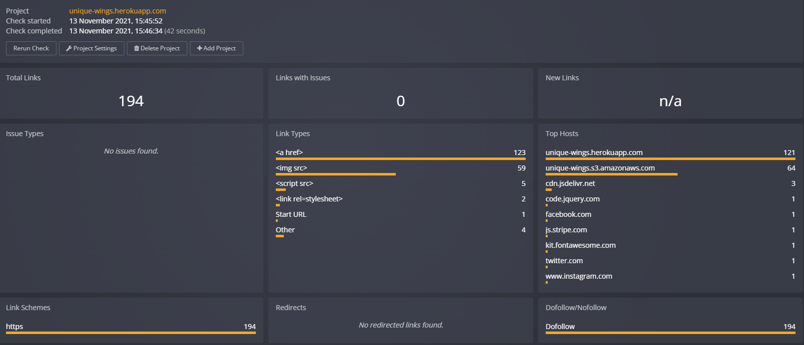 to make sure there are no broken links.

### Responsive Design
---
The website has been tested by using [Chrome DevTools](https://developer.chrome.com/docs/devtools/) and also on [Am I Responsive](http://ami.responsivedesign.is/) and [Responsinator](http://www.responsinator.com/) on a number of devices with varying screen dimensions, for both portrait and landscape views, including iPhone 5/SE, iPhone 6/7/8, iPhone 6/7/8 plus, iPhone 11, iPad, iPad Pro, Moto G4, Galaxy S5, Surface Duo, Galaxy Fold, Widescreen Laptop and Desktop PC, iPad landscape · width: 1024px, iPhone 6-8 Plump landscape · width: 736px ,iPhone 6-8 landscape · width: 667px, Android (Pixel 2) landscape · width: 684px, iPhone expensive landscape · width: 734px

The website was also tested on real devices in both portrait and landscape view. The results with other browsers were satisfying:

Samung Galaxy S6/S7/S8/S10/S20.
Samsung Galaxy Tablet.
iPhone 13
Examples of website view on responsinator
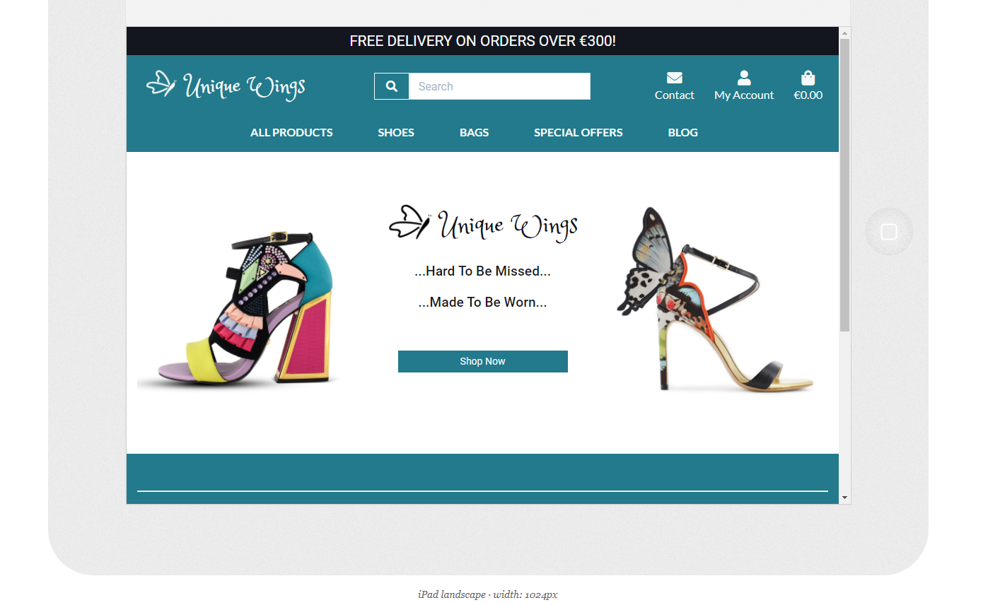

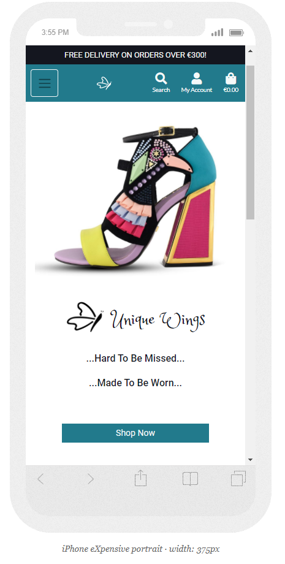

## Testing Compatibility
The website was tested on the following browsers and operating systems:

Google Chrome (Windows 10, Android 11, Safari).

Microsoft Edge (Windows 10).

Firefox (Windows 10).

Opera (Windows 10).
`Test for Opera browser`
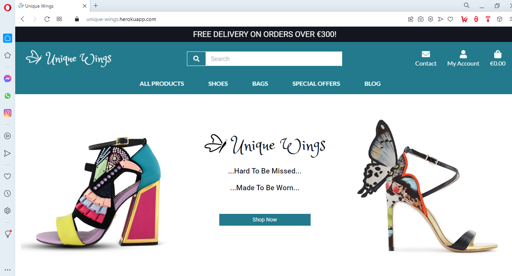

`Test for Firefox browser`
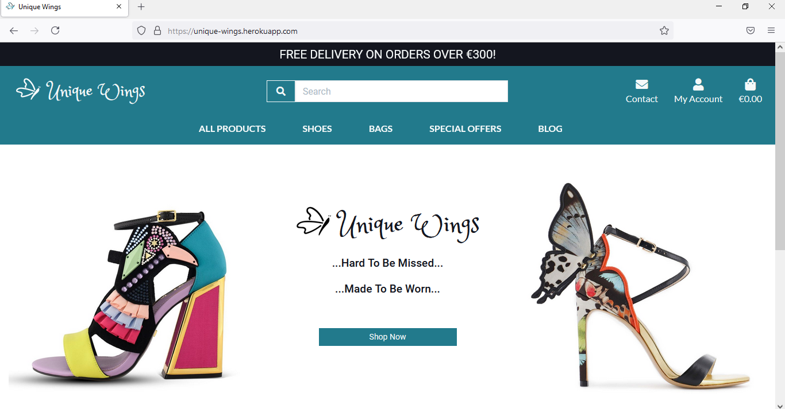

` Test for Microsoft Edge browser`
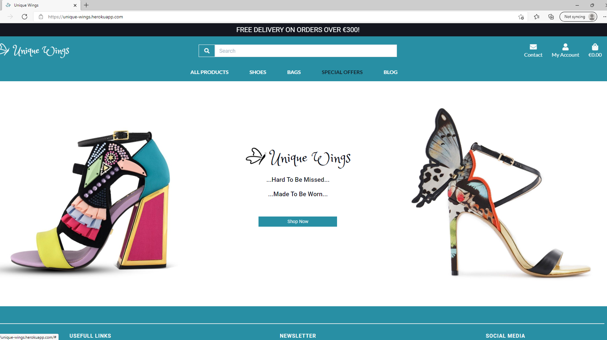

---

---
## Testing Performance
---
Performance has been tested using Lighthouse tool of Google Chrome. The results differed slightly each time on mobile devices, where the performance was a bit worse than on
 desktop devices but overall they were satisfactory.
To improve SEO, the following actions were taken:
- Document doesn't have a meta description FIXED BY: Meta description added to base.html
- Links do not have descriptive text FIXED BY: add `click here` and Unsubscribe text link

To improve best Practices for images on the product detail page "Links to cross-origin destination are unsafe" to make safe open images in separate window "rel="noopener" to `target="_blank"` added which are automatically added by default on chromium browsers but Edge and Internet Explorer helps protect the above explicit specification.
### HOME PAGE DESKTOP
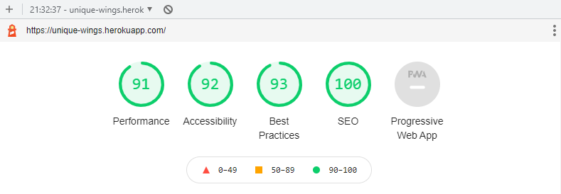

### PRODUCTS PAGE

### DETAIL PRODUCT
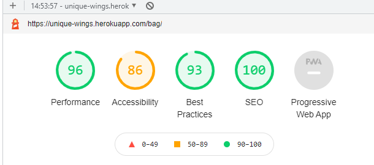

### BLOG
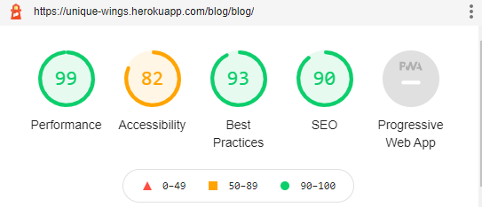

### BLOG POST
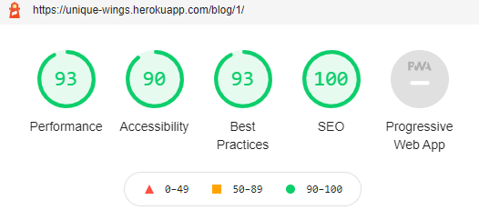

### CONTACT
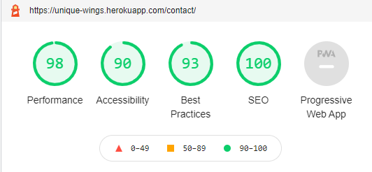

### MY PROFILE
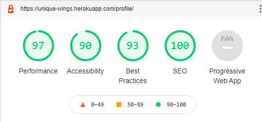

### BLOG MANAGEMENT
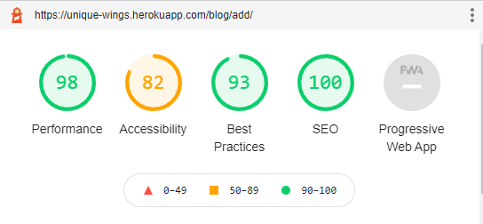

### PRODUCT MANAGEMENT
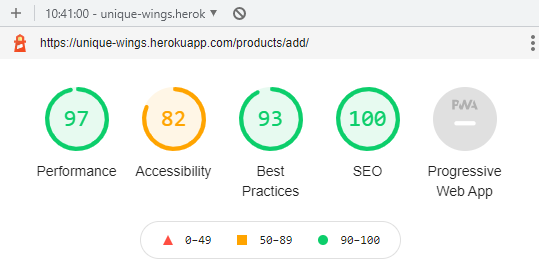

### SHOPPING BAG
## empty shopping bag
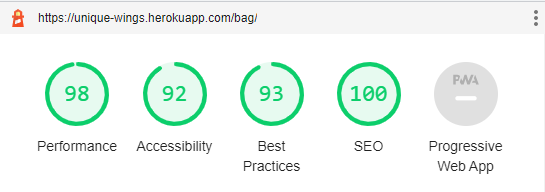
## full shopping bag
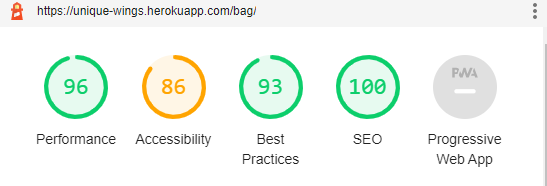

### CHECKOUT
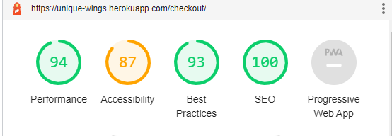

### SIGNUP
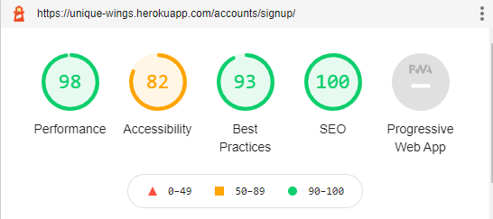

### SIGNOUT
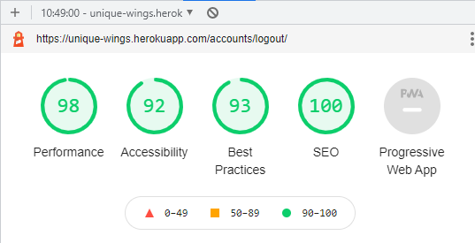

### REGISTER

### REVIEWS
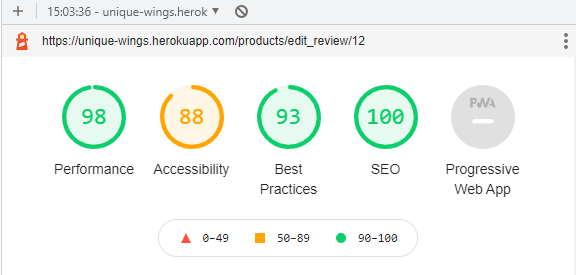

### COMMENTS
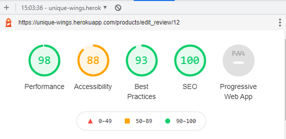

## Testing Accessibility
----
Accessibility was checked on all pages of the websites. Most of the low accessibility issues have been fixed. The problem for the lighthouse was also the div overlay which is placed on the site.
To improve accessibility, the following actions were taken:
- Background and foreground colors did not have a sufficient contrast ratio. FIXED BY: Contrast between font and background color was checked on the [contrast checker](https://webaim.org/resources/contrastchecker/) and slightly darkened.

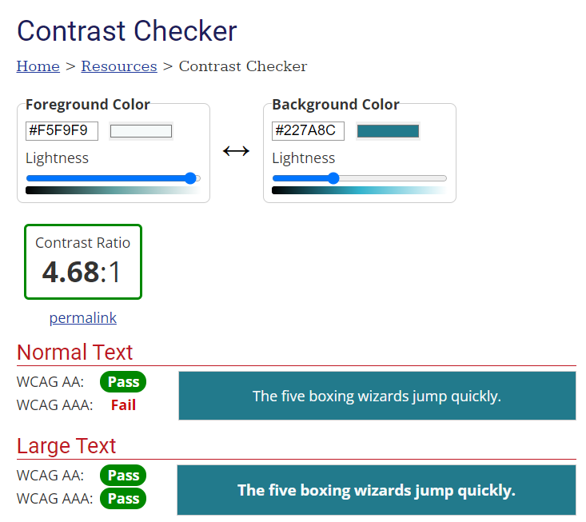
- Buttons do not have a accessible name FIXED BY: adding aria-label="search button" in base.html, aria-label="decrement quantity button", aria-label="increment quantity button", aria-label="input-quantity-form" in quantity-form.html for quantity buttons.
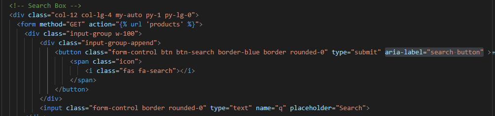
- Heading elements are not in a sequentially - descending order FIXED BY: "Shop Now" button on the home page heading changed from `<h4>` to `<h2>` also in bag total.html headings for Delivery changed to '<h5> and class small added to keep correct visual look.</h5>

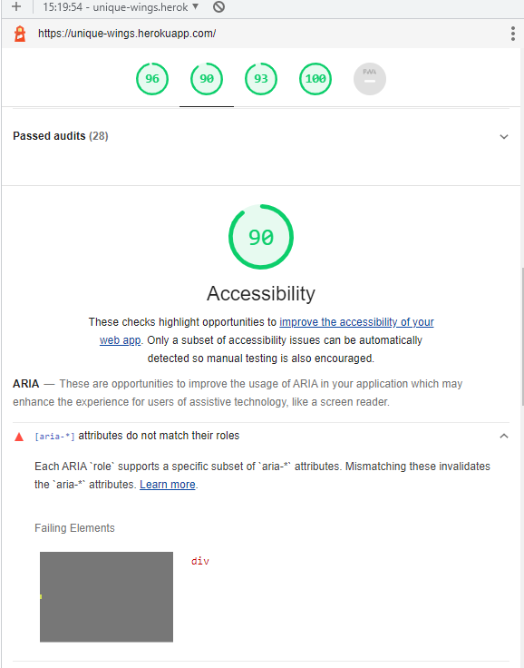

## Further Testing
Additional testing 

### Overflow
- The website was tested for overflow using [Unicorn Revealer](https://chrome.google.com/webstore/detail/unicorn-revealer/lmlkphhdlngaicolpmaakfmhplagoaln?hl=en-GB) chrome extension.
- Spelling was checked thoroughly using [Grammarly](https://www.grammarly.com/) extension and [online-spellcheck](https://www.online-spellcheck.com/)