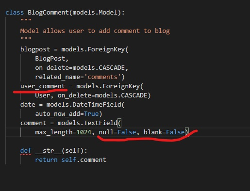

# Testing

- [Encountered Issues](#ecountered-issues)
- [Code Validation](#code-validation)
- [Testing User stories](#testing-user-stories)
- [Testing Functionality](#testing-functionality)
- [Testing Compatibility](#testing-compatibility)
- [Testing Accessibility](#testing-accessibility)
- [Testing Performance](#testing-performance)
- [Further Testing](#further-testing)

## Encountered Issues
---

**Project Bugs And solutions**
---
While working on this project I encountered the following problems which I tried to solve in the following way:
1. ERROR: IntegrityError at/accounts/login/ unique constrant failed:profiles.user_id showed while registering new user and trying to sign in 

    SOLVING BY: 
    - Checking for code differences in diffchecker (came out correct) ,
    - Created a new superuser (still left with the same error),
    - Deleted the db.sqlite3 file in workspace, make and run migrations, loaded my fixtures for categories.json and product.json, then created a new superuser (still didn't work)
    - Checked all related files and the issue was forgotten undo uncommited lines in models.py 
        - from
    
        - to
    

2. ERROR: while making purchase on the site and receivind an order confirmation on the profile site and success message the confirmation email doesn't appear in the terminal. Instead the error `POST /checkout/wh/HTTP/1.1 500 146184` and TemplateDoesntExist received

    SOLVED BY:
   - Checking for typos and correct place for **confirmation_emails** folder and webhook_handler.py
   - Checking the webhooks are correct, updating in the settings variables, and on the stripe site 
   - The error came from a typo in the `confirmation_email_subject.txt`

3. ERROR: While saving the comment on the "Add Comment" form the Integrity error not hull constraint failed: blog_blogcomment.user_comment_id appear

    SOLVED BY: 
    - changing in models.py BlogComment class comment values `null=True` and `blank=True`
    - wrong spelled name in the views.py `comment_user` => `user_comment`

4. ERROR: While implementing modal a problem with dislayng on the screen

    SOLVED BY:
    - It was a typo in id 

5. BUG: `Delete|Edit` buttons for comments don't hide when user is on his account is able to to see other users buttons

    SOLVED BY:
    - Changing if statement

6. ISSUE: While adding missing message field into the models.py in contact form a makemigration non-nullable firld 'message' issue appeared

SOLVED BY: 
- value: null=False changed to null=True
- value: blank-False changed to null=True
7. ISSUE: While testing the contact form message field didn't work as expected (no validation) and also the makemigration message appeared

SOLVED BY: 
- in models message atribute value blank=True changed to null=False and null=True stayed the same
- before migrations database with sent emails was deleted

8. BUG: Input placeholders are not displayed on the Contact page as expected, default labels are enabled.

SOLVED BY:
- wrong intendation 

9. I encountered a few difficulties when creating a subscription app for the newsletter
    a) BUG : The newsletter-subscription form don't display on the site 
    SOLVED BY: Forgot to add the context to the context processors in settings.py `'contexts.subscription_form',` 
    
    b) ERROR: No Reverse Match at contact/newsletter signup 
     
    SOLVED BY: It was wrong return 'newsletter_form' whis is a value not a URL changed to redirect_url add in footer.html in the form a hidden input field and change view to get the redirect_url from the form and then redirect it to the redirect_url
    
    
    
## Code Validation
---

## Testing User stories
---

## Testing Functionality

### Checking for broken links
---

### Responsive Design
---

 **Encountered problems while testing the site on different devices**
 

## Testing Compatibility
---

---
## Testing Performance
---

## Testing Accessibility
----

- **Accessibility for mobile devices on LightHouse**

## Further Testing

### Overflow
